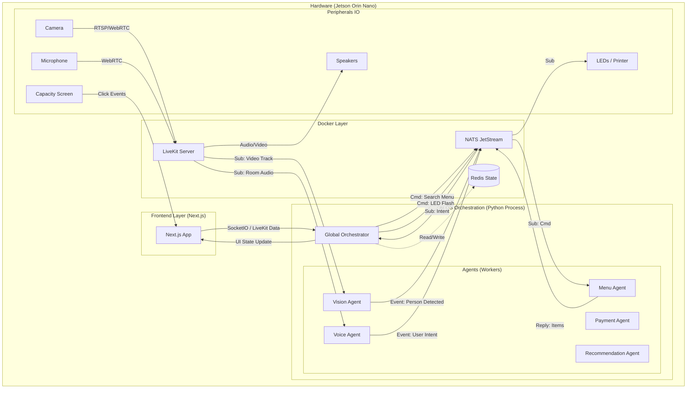

# Food Court Kiosk - System Architecture Overview

## 1. Executive Summary
This document outlines the architecture for an intelligent Food Court Kiosk leveraging a **Multi-Agent AI** approach, **Generative UI**, and the **Jetson Orin Nano** hardware platform. The system aims to provide a hyper-personalized, multimodal (Voice, Video, Touch) ordering experience.

## 2. Architectural Pillars

### 2.1 Multi-Agent Orchestrator (The Brain)
At the core is an **Orchestrator Agent** responsible for:
- Managing the global state of the user session (intent, cart, budget, emotional state).
- Routing user inputs (speech, gaze, touch) to the appropriate sub-agents.
- Deciding "what to show" on the screen, driving the Generative UI parameters.

### 2.2 Specialized Agents
The system decomposes responsibilities into specialized agents to ensure reliability and modularity:
1.  **Menu & Order Agent**: Expert on the catalog, dietary filters, and inventory. Manages the cart.
2.  **Recommendation Agent**: Personalizes suggestions based on order history (if available), trending items, or visual cues (e.g., "I see you're with a child, maybe a Happy Meal?").
3.  **Payment & Checkout Agent**: Handles secure transaction processing and loyalty programs.
4.  **Hardware Liaison Agent**: Interfaces with the physical world (receipt printing, card reader, LED indicators on the kiosk).

### 2.3 Generative UI (GenUI)
Unlike static menus, the UI is fluid. The **Orchestrator** emits *UI State Descriptors*.
- A frontend engine (Web-based) renders these descriptors dynamically.
- **Example**: If the user asks for "Spicy options", the UI morphs to highlight spicy dishes with flame motifs, hiding non-relevant items.
- **Multimodal Inputs**:
    - *Audio*: Real-time STT (Speech-to-Text) listening for commands.
    - *Video*: Computer Vision on the Jetson Orin Nano interacting with the user (e.g., waking up availability when a face is detected).
    - *Touch*: Standard capacitive interaction.

## 3. Comprehensive System Diagram

## 4. Workflow Overview
1.  **Attract Mode**: Vision model detects a person approaching. Kiosk wakes up, GenUI displays a welcoming animation.
2.  **Interaction Start**: User speaks "I want a burger" or touches the screen.
3.  **Orchestration**:
    - Input is processed.
    - Orchestrator consults `MenuAgent`.
    - `MenuAgent` retrieves burger options.
    - `RecsysAgent` adds "Fries?" suggestion.
4.  **Generation**: Orchestrator composes a layout showing Burgers prominently with a side-bar for Fries.
5.  **Feedback**: User selects items. GenUI updates cart in real-time.
6.  **Checkout**: Payment Agent handles flow. Receipt prints.

