# Food Court Kiosk - System Architecture Overview

## 1. Executive Summary
This document outlines the architecture for an intelligent Food Court Kiosk leveraging a **Multi-Agent AI** approach, **Generative UI**, and the **Jetson Orin Nano** hardware platform. The system aims to provide a hyper-personalized, multimodal (Voice, Video, Touch) ordering experience.

## 2. Architectural Pillars

### 2.1 Multi-Agent Orchestrator (The Brain)
At the core is an **Orchestrator Agent** responsible for:
- Managing the global state of the user session (intent, cart, budget, emotional state).
- Routing user inputs (speech, gaze, touch) to the appropriate sub-agents.
- Deciding "what to show" on the screen, driving the Generative UI parameters.

### 2.2 Specialized Agents
The system decomposes responsibilities into specialized agents to ensure reliability and modularity:
1.  **Menu & Order Agent**: Expert on the catalog, dietary filters, and inventory. Manages the cart.
2.  **Recommendation Agent**: Personalizes suggestions based on order history (if available), trending items, or visual cues (e.g., "I see you're with a child, maybe a Happy Meal?").
3.  **Payment & Checkout Agent**: Handles secure transaction processing and loyalty programs.
4.  **Hardware Liaison Agent**: Interfaces with the physical world (receipt printing, card reader, LED indicators on the kiosk).

### 2.3 Generative UI (GenUI)
Unlike static menus, the UI is fluid. The **Orchestrator** emits *UI State Descriptors*.
- A frontend engine (Web-based) renders these descriptors dynamically.
- **Example**: If the user asks for "Spicy options", the UI morphs to highlight spicy dishes with flame motifs, hiding non-relevant items.
- **Multimodal Inputs**:
    - *Audio*: Real-time STT (Speech-to-Text) listening for commands.
    - *Video*: Computer Vision on the Jetson Orin Nano interacting with the user (e.g., waking up availability when a face is detected).
    - *Touch*: Standard capacitive interaction.

---

## 3. System State Machine

The kiosk transitions through these high-level states:

---

## 4. Comprehensive System Diagram

---

## 5. Data Flow Diagram

Shows how data transforms from input to output:

```mermaid
flowchart LR
    subgraph Input["📥 Input Layer"]
        Audio[🎤 Audio]
        Video[📷 Video]
        Touch[👆 Touch]
    end
    
    subgraph Processing["⚙️ Processing Layer"]
        STT["Faster-Whisper<br/>(STT)"]
        CV["DeepStream<br/>(Vision)"]
        Intent["Gemini 2.0 Flash<br/>(Intent Parser)"]
    end
    
    subgraph Agents["🤖 Agent Layer"]
        Orch[Orchestrator]
        Menu[Menu Agent]
        Rec[Rec Agent]
        Pay[Payment Agent]
    end
    
    subgraph Output["📤 Output Layer"]
        UI["GenUI<br/>(Next.js)"]
        TTS["TTS<br/>(Audio)"]
        HW["Hardware<br/>(LEDs/Printer)"]
    end
    
    Audio --> STT --> Intent --> Orch
    Video --> CV --> Orch
    Touch --> Orch
    
    Orch <--> Menu
    Orch <--> Rec
    Orch <--> Pay
    
    Orch --> UI
    Orch --> TTS
    Orch --> HW
```

---

## 6. Security Architecture

> [!CAUTION]
> Security is critical for a payment-handling kiosk. This system must adhere to PCI-DSS guidelines.

### 6.1 Security Zones

### 6.2 Security Measures

| Area | Measure |
|------|---------|
| **API Keys** | Stored in hardware-backed keystore, never in code |
| **Payment Data** | Never logs or persists card numbers (PCI-DSS) |
| **Session Tokens** | Short-lived (5 min), stored in Redis with TTL |
| **Communication** | All external calls over TLS 1.3 |
| **Physical** | Tamper-detection on card reader enclosure |

---

## 7. Resilience & Error Handling

### 7.1 Circuit Breaker Pattern

### 7.2 Fallback Strategies

| Failure | Fallback |
|---------|----------|
| Gemini API timeout | Use cached responses + simple keyword matching |
| STT failure | Prompt user to use touch interface |
| Payment failure | Offer retry or alternative payment |
| Camera failure | Skip attract mode, wait for touch/voice |

### 7.3 Graceful Degradation Modes

1. **Full Mode**: All AI features enabled
2. **Reduced Mode**: Local-only processing (no Gemini)
3. **Basic Mode**: Touch-only ordering with static menus

---

## 8. Workflow Overview

1.  **Attract Mode**: Vision model detects a person approaching. Kiosk wakes up, GenUI displays a welcoming animation.
2.  **Interaction Start**: User speaks "I want a burger" or touches the screen.
3.  **Orchestration**:
    - Input is processed.
    - Orchestrator consults `MenuAgent`.
    - `MenuAgent` retrieves burger options.
    - `RecsysAgent` adds "Fries?" suggestion.
4.  **Generation**: Orchestrator composes a layout showing Burgers prominently with a side-bar for Fries.
5.  **Feedback**: User selects items. GenUI updates cart in real-time.
6.  **Checkout**: Payment Agent handles flow. Receipt prints.

---

## 9. Latency Budget

For a responsive user experience, total round-trip must be under **1 second**.

| Operation | Target | Technology | Risk Level |
|-----------|--------|------------|------------|
| Voice Detection (VAD) | <100ms | LiveKit VAD | ✅ Low |
| STT Processing | <300ms | NVIDIA Riva | ✅ Low |
| Intent Analysis | <400ms | Gemini 2.0 Flash | ⚠️ Medium |
| Menu Search (RAG) | <100ms | Local SQLite + Vector | ✅ Low |
| UI Update | <50ms | LiveKit Data Channel | ✅ Low |
| **Total** | **<950ms** | - | ✅ Achievable |
