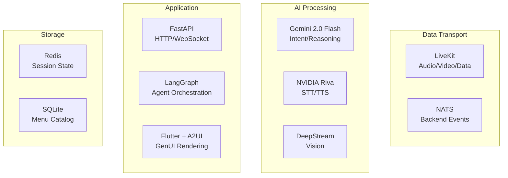

# Tech Stack Selection & Justification

This document details each technology choice, what it **does**, what it **doesn't do**, and why it was selected.

---

## 1. Hardware Platform: NVIDIA Jetson Orin Nano

### Specifications
| Spec | Value |
|------|-------|
| CPU | 6-core ARM Cortex-A78AE |
| GPU | Ampere (1024 CUDA cores) |
| RAM | 8GB LPDDR5 (Unified) |
| AI Perf | 40 TOPS (INT8) |
| Power | 7-15W |

### ✅ What It Does
- Runs local AI inference (STT, Vision) with GPU acceleration
- Hosts the full orchestration stack in Docker
- Provides hardware interfaces (GPIO, USB, HDMI)
- Runs 24/7 as a kiosk appliance
- Supports NVIDIA DeepStream and TensorRT for optimized inference

### ❌ What It Doesn't Do
- **NOT a cloud server**: Limited to edge workloads
- **NOT infinite memory**: Only 8GB shared between CPU/GPU
- **NOT x86**: Some libraries may need ARM compilation
- **NOT for training**: Inference only

### Why Selected
User requirement. Best-in-class edge AI platform for this price point.

---

## 2. LLM: Google Gemini 2.0 Flash

### Model Selection

| Model | Use Case | Latency | Cost |
|-------|----------|---------|------|
| **Gemini 2.0 Flash** ⭐ | Primary orchestration | ~300ms | Medium |
| Gemini 1.5 Pro | Complex multi-modal fallback | ~800ms | Higher |
| Gemini 1.5 Flash | Simple queries (deprecated path) | ~200ms | Low |

> [!TIP]
> **Gemini 2.0 Flash** is the recommended primary model—it offers the best balance of reasoning capability and speed.

### ✅ What It Does
- Complex natural language understanding ("I want something healthy but not too spicy")
- Structured JSON output for UI generation
- Multi-turn conversation memory (via context)
- Multi-modal analysis (can process images if needed)
- Function calling for agent orchestration

### ❌ What It Doesn't Do
- **NOT local**: Requires internet connection (cloud API)
- **NOT free**: Costs per token
- **NOT deterministic**: Same input can produce varied outputs
- **NOT real-time**: 200-800ms latency per call
- **NOT for simple tasks**: Overkill for "yes/no" type queries

### Why Selected
User requirement. Gemini offers excellent structured output capabilities critical for Generative UI.

### Integration
```python
# google-generativeai SDK
import google.generativeai as genai
genai.configure(api_key=os.environ["GEMINI_API_KEY"])
model = genai.GenerativeModel("gemini-2.0-flash")
```

---

## 3. Backend: Python + FastAPI

### ✅ What Python Does
- Native language for AI/ML ecosystem
- First-class support for Jetson libraries (CUDA, TensorRT)
- Excellent Gemini SDK support
- Rapid prototyping and iteration

### ❌ What Python Doesn't Do
- **NOT high performance**: GIL limits true parallelism
- **NOT type-safe at runtime**: Type hints are optional
- **NOT memory efficient**: Higher overhead than Rust/Go

### ✅ What FastAPI Does
- Async request handling (critical for concurrent agents)
- Automatic OpenAPI documentation
- Pydantic validation (great for LLM structured outputs)
- WebSocket support for real-time updates

### ❌ What FastAPI Doesn't Do
- **NOT a message broker**: Use NATS for inter-agent communication
- **NOT auto-scaling**: Single process without external orchestration
- **NOT providing WebRTC**: Use LiveKit for that

### Why Selected
Python is mandatory for AI workloads on Jetson. FastAPI provides the async foundation needed for multi-agent orchestration.

---

## 4. Multi-Agent Framework: LangGraph

### ✅ What It Does
- Defines agent workflows as directed graphs (including cycles)
- Built-in state checkpointing and persistence
- Deterministic routing (critical for payment flows)
- Human-in-the-loop support
- Streaming responses

### ❌ What It Doesn't Do
- **NOT automatic**: You must define the graph explicitly
- **NOT autonomous agents**: No "let the AI figure it out" loops
- **NOT simple**: Steeper learning curve than basic prompting
- **NOT standalone**: Requires LangChain ecosystem

### Alternatives Considered

| Framework | Pros | Cons | Verdict |
|-----------|------|------|---------|
| **LangGraph** ⭐ | Deterministic, checkpoints | Complex DSL | Selected |
| CrewAI | Simple role-based agents | Less control over flow | Consider for v2 |
| Autogen | Multi-agent chat | Harder to make deterministic | Not suitable |

### Why Selected
Payment and ordering require **deterministic, auditable flows**. LangGraph provides explicit control over state transitions.

---

## 5. Real-Time Communication: LiveKit

### ✅ What It Does
- WebRTC server for audio/video streaming
- `livekit-agents` SDK for Python backend processing
- Room-based architecture (one room per kiosk session)
- Data channels for low-latency messaging
- Built-in VAD (Voice Activity Detection)
- Can run locally in Docker on Jetson

### ❌ What It Doesn't Do
- **NOT a message broker**: Use NATS for backend events
- **NOT for storage**: Ephemeral streams only
- **NOT AI processing**: Just transport (you add STT/TTS)
- **NOT lightweight**: ~200MB RAM overhead

### Why Selected
Provides a unified solution for handling microphone input, camera video, and speaker output. Eliminates custom WebSocket chunking code.

### Deployment
```bash
# Docker on Jetson
docker run -d --name livekit \
  -p 7880:7880 -p 7881:7881 -p 7882:7882/udp \
  livekit/livekit-server --dev
```

---

## 6. Event Bus: NATS JetStream

### ✅ What It Does
- Pub/Sub messaging between agents
- Request/Reply pattern for synchronous calls
- Message persistence with JetStream
- At-least-once delivery guarantees
- Lightweight (~50MB RAM)

### ❌ What It Doesn't Do
- **NOT a database**: Use Redis/SQLite for state
- **NOT RPC framework**: No code generation like gRPC
- **NOT for large payloads**: Best for small JSON messages
- **NOT authenticated by default**: Must configure TLS/auth

### Why Selected
Perfect for event-driven microservices. Much lighter than Kafka while providing durability via JetStream.

---

## 7. Speech-to-Text: NVIDIA Riva (Recommended)

> [!IMPORTANT]
> Changed from Faster-Whisper to NVIDIA Riva for better Jetson optimization.

### ✅ What Riva Does
- Streaming ASR (real-time transcription)
- TensorRT optimized for Jetson
- Sub-100ms latency
- Speaker diarization (optional)
- Multiple language support

### ❌ What Riva Doesn't Do
- **NOT open-source weights**: Licensed by NVIDIA
- **NOT small**: Requires 2-4GB model download
- **NOT Python-native**: gRPC interface

### Alternative: Faster-Whisper

| Criteria | NVIDIA Riva | Faster-Whisper |
|----------|-------------|----------------|
| Latency | ~100ms | ~300ms |
| Accuracy | High | High |
| Jetson Optimized | ✅ Native | ⚠️ Via CUDA |
| Streaming | ✅ Yes | ❌ Batch only |

### Why Riva Selected
Purpose-built for Jetson. Streaming ASR enables real-time voice interaction without waiting for silence.

---

## 8. Computer Vision: NVIDIA DeepStream

### ✅ What It Does
- GPU-accelerated video pipeline
- Face detection/tracking
- Gaze estimation
- TensorRT inference integration
- Multi-stream processing

### ❌ What It Doesn't Do
- **NOT for audio**: Vision only
- **NOT a model**: You provide the models
- **NOT simple**: Complex GStreamer-based API
- **NOT for WebRTC**: Use LiveKit for transport

### Integration Strategy
```
Camera → DeepStream → [Face/Gaze Detection] → Metadata Events → NATS
                   ↘ Low-res Preview → LiveKit (for remote debug)
```

### Why Selected
Only option for real-time CV on Jetson with full GPU acceleration.

---

## 9. Frontend: Flutter + A2UI + GenUI

> [!IMPORTANT]
> Changed from Next.js to Flutter for better kiosk performance and native hardware access.

### Why Flutter over Next.js?

| Criteria | Flutter | Next.js |
|----------|---------|---------|
| Performance | Native-like (Skia) | Browser-based |
| Kiosk Mode | Native support | Chromium wrapper |
| Offline | Full support | Limited |
| Camera/Mic | Direct hardware | WebRTC only |
| Bundle Size | ~15MB | Browser + ~5MB |
| RAM Usage | ~200MB | ~500MB (Chromium) |
| Jetson ARM | Native | Via Chromium |

### ✅ What Flutter Does
- Cross-platform native-like rendering (Skia engine)
- Direct hardware access (camera, microphone)
- Rich animation framework built-in
- Strong typing with Dart
- Hot reload for rapid development
- Native kiosk mode on Linux/Jetson

### ❌ What Flutter Doesn't Do
- **NOT web-native**: Requires native embedding
- **NOT JavaScript**: Different ecosystem (Dart)
- **NOT modular delivery**: Full app bundle

### A2UI Design System
Custom component library for kiosk interfaces:
- High-contrast, accessible components
- Touch-optimized (48px minimum touch targets)
- Smooth animations and transitions
- Consistent theming system

### GenUI (Generative UI)
Dynamic UI rendering from backend JSON:
- Backend sends UI descriptors (JSON)
- Flutter renders widgets dynamically
- Enables AI-driven interface changes
- No app updates needed for UI changes

### Why Selected
Better performance on Jetson ARM, native kiosk support, and direct hardware access for camera/microphone.

---

## 10. State Storage: Redis

### ✅ What It Does
- In-memory key-value store
- Session state (cart, user context)
- TTL-based expiration (auto-cleanup)
- Pub/Sub (secondary to NATS)
- Atomic operations

### ❌ What It Doesn't Do
- **NOT persistent by default**: Enable AOF for durability
- **NOT relational**: No complex queries
- **NOT for large data**: Keep values small

### Alternative Considered: KeyDB

| Criteria | Redis | KeyDB |
|----------|-------|-------|
| Performance | Baseline | 5x faster (multi-threaded) |
| Compatibility | Standard | Redis protocol compatible |
| ARM Support | ✅ | ✅ |

> [!TIP]
> Consider KeyDB if Redis becomes a bottleneck, but Redis is sufficient for single-kiosk deployment.

---

## 11. Database: SQLite (Primary) + PostgreSQL (Optional)

### SQLite for Menu/Catalog

#### ✅ What It Does
- Zero-config embedded database
- Perfect for read-heavy menu queries
- Single file, easy backup
- Full-text search support

#### ❌ What It Doesn't Do
- **NOT for concurrent writes**: Single writer only
- **NOT networked**: Local file only

### PostgreSQL for Multi-Kiosk Deployments

Use PostgreSQL when:
- Centralized menu management across multiple kiosks
- Transaction logging with strong durability
- Complex analytics queries

---

## 12. Removed: Socket.IO

> [!WARNING]
> **Socket.IO has been removed from the stack.**

### Why Removed
- **Redundant**: LiveKit Data Channels provide the same functionality
- **Adds complexity**: Three communication channels is too many
- **Less efficient**: Additional connection overhead

### Migration Path
All frontend ↔ backend communication now uses:
1. **LiveKit Data Channels** - for real-time events (touch, UI updates)
2. **NATS** - for backend-only agent communication

---

## Summary: Technology Responsibility Matrix



| Layer | Technology | Responsibility |
|-------|------------|----------------|
| Hardware | Jetson Orin Nano | Edge compute platform |
| LLM | Gemini 2.0 Flash | Natural language + reasoning |
| STT/TTS | NVIDIA Riva | Voice processing |
| Vision | DeepStream | Face/gaze detection |
| Transport | LiveKit | Audio/video streaming |
| Events | NATS JetStream | Agent messaging |
| Backend | FastAPI + LangGraph | Orchestration |
| Frontend | Flutter + A2UI | GenUI rendering |
| State | Redis | Session data |
| Database | SQLite | Menu catalog |
