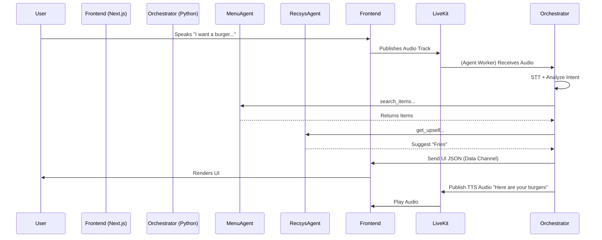

# Component Design & Specifications

## 1. Orchestrator (The "Brain")
The Orchestrator is a stateful agent that manages the interaction loop. It coordinates other agents via **NATS** messages.

### 1.1 State Machine
The system transitions through these high-level states:
    -   *DeepStream or LiveKit Vision Plugin* analyzes the Room video track.
    -   *Event*: `kiosk.vision.person_detected`
3.  **LISTENING**: LiveKit Agent subscribes to user audio. VAD (Voice Activity Detection) triggers STT.
4.  **PROCESSING**: Text -> Intent Analysis (Gemini).
    -   *Event*: `kiosk.input.text` -> `kiosk.intent.derived`
5.  **DECIDING**: Routing intent to sub-agents via NATS Request/Reply.
    -   *Request*: `kiosk.agent.menu.search` (Payload: `{ "query": "burger" }`)
6.  **UPDATING**: Generating new UI State JSON -> Frontend.
    -   *Event*: `kiosk.ui.update` (Payload: `{ "components": [...] }`)
7.  **CHECKOUT**: Handover to Payment.

### 1.2 Context Vector
The Orchestrator maintains a `SessionContext` object:
```json
{
  "session_id": "uuid",
  "user_demographics": {"age_group": "adult", "emotion": "happy"},
  "cart": [],
  "dietary_restrictions": ["variable"],
  "interaction_history": ["showed_burgers", "user_rejected_fries"]
}
```

## 2. Agent Definitions

### 2.1 Menu Agent
*   **Role**: Retrieval Augmented Generation (RAG) over the Menu Database.
*   **Tools**:
    *   `search_items(query: str, tags: list)`
    *   `get_nutritional_info(item_id)`
    *   `check_stock(item_id)`

### 2.2 Recommendation Agent (RecSyS)
*   **Role**: Proactive upselling.
*   **Logic**:
    *   Input: Current Cart + External Context (Time of day, Weather).
    *   Output: List of 1-3 suggested Item IDs with "Pitch Text".
    *   *Example*: "It's hot outside, suggest a cold Cola."

### 2.3 Hardware Liaison Agent
*   **Role**: Abstraction layer for Jetson Orin GPIO/Peripherals.
*   **Tools**:
    *   `set_led_strip(color: hex, pattern: enum)`: Reacts to voice (pulsing) or errors (red).
    *   `dispense_card()` / `print_receipt()`
    *   `rotate_camera(angle)`: If using a PTZ camera to follow the user.

## 3. Generative UI Protocol (UI-over-JSON)

The Orchestrator doesn't send HTML. It sends a **UI Descriptor**. The Next.js frontend is a "dumb" renderer of this schema.

### 3.1 Schema Definition
```json
{
  "layout_mode": "hero_grid", 
  "theme_override": "spicy_season",
  "auditory_response": "Here are our spicy options.",
  "components": [
    {
      "type": "HeroItem",
      "data": { "id": 101, "image": "/img/burger.png", "title": "Volcano Burger", "badge": "Hot" }
    },
    {
      "type": "Carousel",
      "data": [ ...items ]
    }
  ],
  "suggested_actions": ["Add to cart", "Show less spicy"]
}
```

### 3.2 Feedback Loop
1.  **User touches "Volcano Burger"**: Frontend sends event `{"action": "select_item", "id": 101}` to Backend.
2.  **Orchestrator**: Updates `cart`, calls `RecsysAgent` (returns "Add drink?").
3.  **Orchestrator**: Sends new UI JSON with Burger in Cart and "Add Drink" modal.

## 4. Sequence Diagram: Ordering Flow


