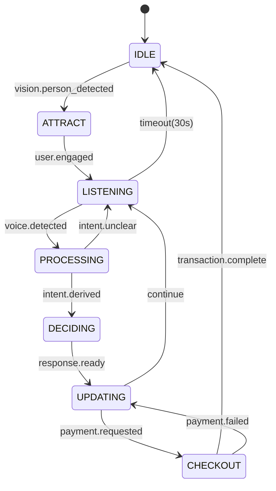
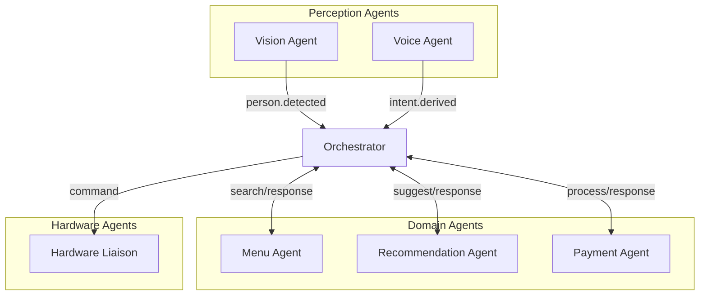
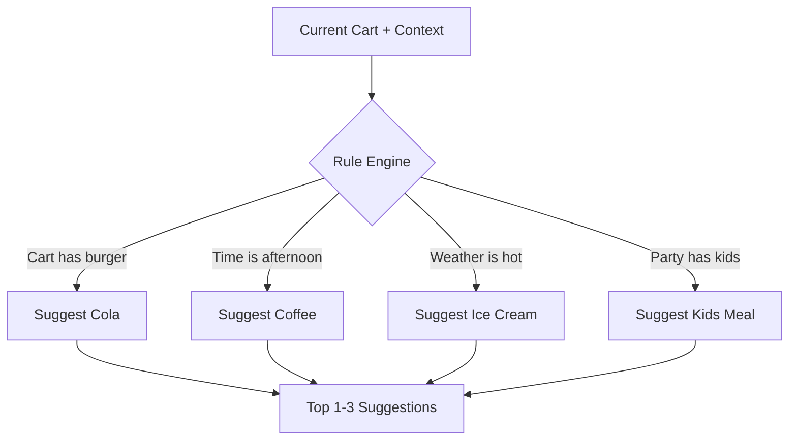
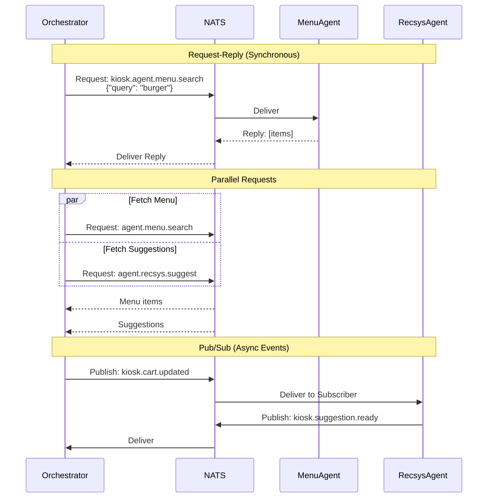
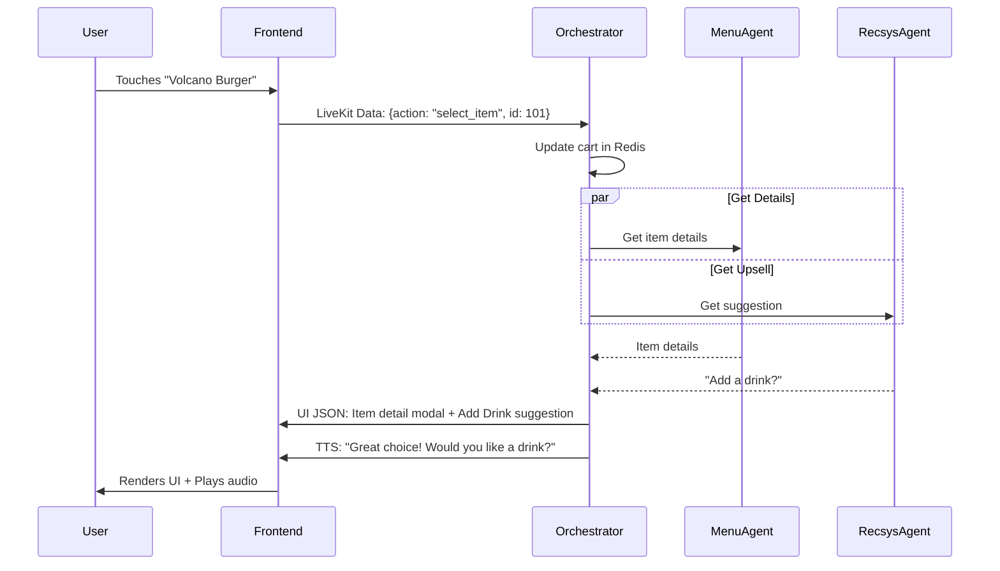
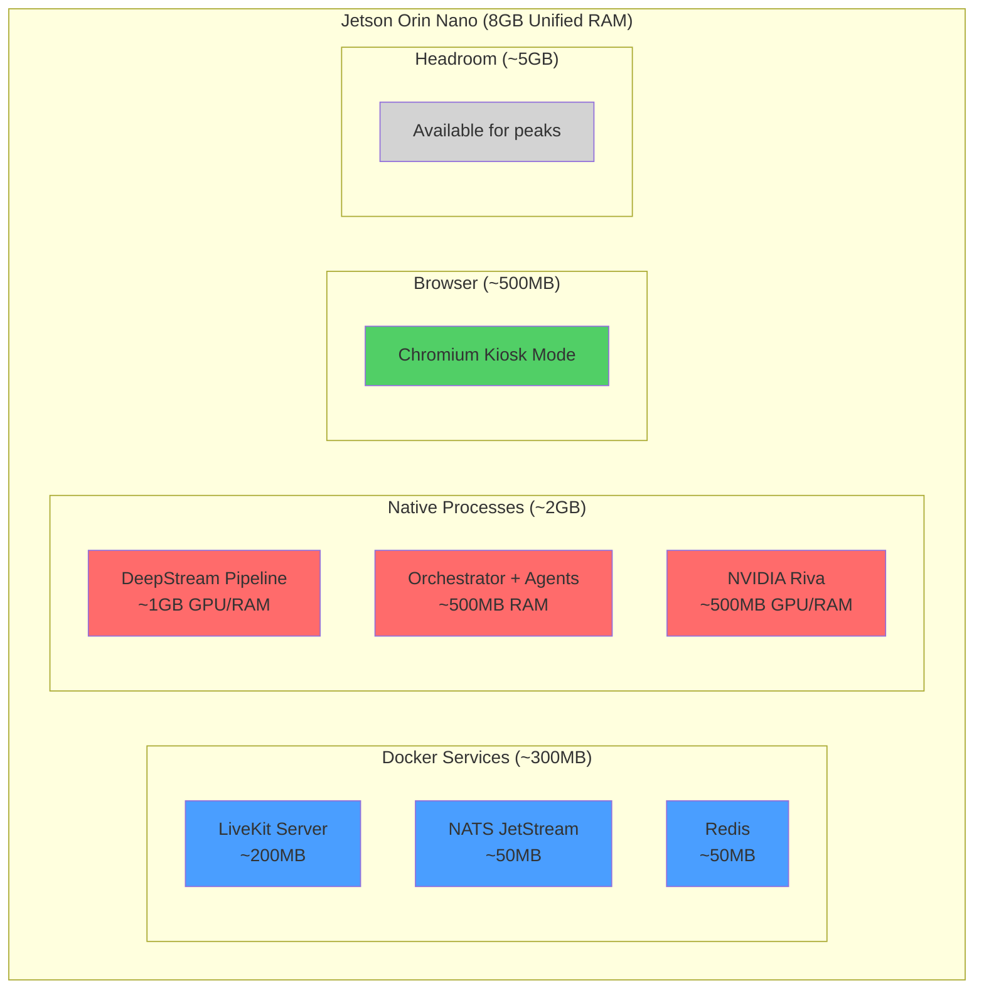
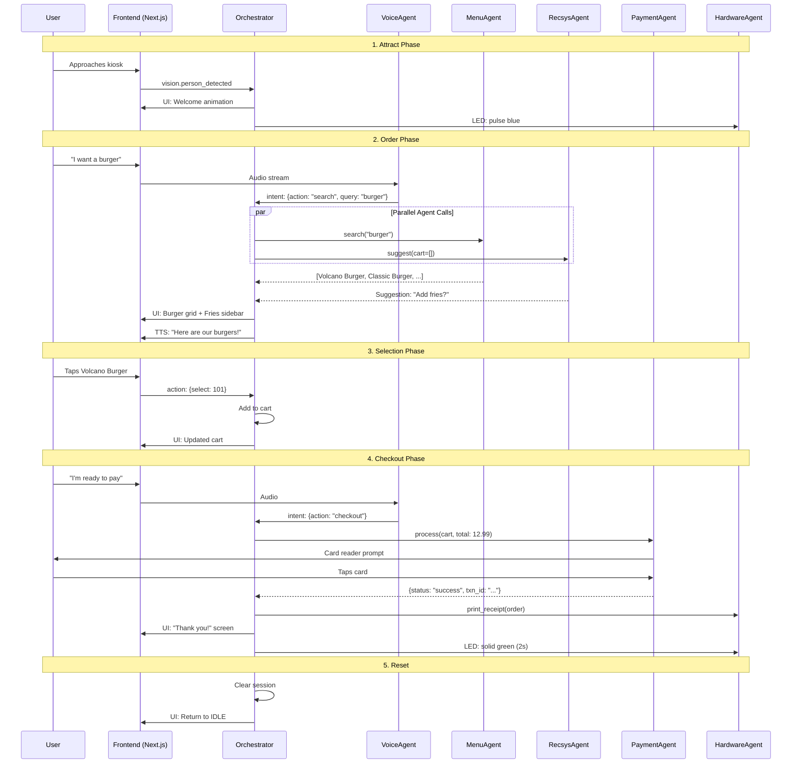

# Component Design & Specifications

This document details the internal design of each component and how they interact.

---

## 1. Orchestrator (The "Brain")

The Orchestrator is a stateful agent that manages the interaction loop. It coordinates other agents via **NATS** messages and controls the Generative UI.

### 1.1 Responsibilities

| Responsibility | Description |
|----------------|-------------|
| State Management | Tracks session state (cart, preferences, history) |
| Intent Routing | Dispatches processed intents to appropriate agents |
| UI Generation | Produces UI State JSON for the frontend |
| Response Synthesis | Combines agent outputs into coherent responses |
| Error Handling | Implements fallback strategies when agents fail |

### 1.2 State Machine

The Orchestrator transitions through these states:



### 1.3 State Definitions

| State | Description | Entry Trigger | Exit Actions |
|-------|-------------|---------------|--------------|
| `IDLE` | Kiosk dormant, low power | Boot or session end | Clear session state |
| `ATTRACT` | Welcoming animation | Person detected | Start VAD listening |
| `LISTENING` | Waiting for user input | User engagement | Monitor audio/touch |
| `PROCESSING` | STT + Intent analysis | Voice detected | Call Gemini for intent |
| `DECIDING` | Routing to sub-agents | Intent derived | Dispatch NATS requests |
| `UPDATING` | Generating UI response | Agent replies received | Emit UI JSON + TTS |
| `CHECKOUT` | Payment flow active | User confirms cart | Hand off to PaymentAgent |

### 1.4 Session Context

The Orchestrator maintains a `SessionContext` object in Redis:

```json
{
  "session_id": "uuid-v4",
  "state": "LISTENING",
  "started_at": "2026-01-12T08:30:00Z",
  "user_demographics": {
    "age_group": "adult",
    "emotion": "happy",
    "party_size": 2
  },
  "cart": [
    {"item_id": 101, "name": "Volcano Burger", "qty": 1, "price": 12.99}
  ],
  "dietary_restrictions": ["vegetarian"],
  "interaction_history": [
    {"type": "showed", "items": ["burgers"]},
    {"type": "rejected", "items": ["fries"]}
  ],
  "last_activity": "2026-01-12T08:32:00Z"
}
```

---

## 2. Agent Definitions

### 2.1 Overview Diagram



### 2.2 Vision Agent

| Aspect | Details |
|--------|---------|
| **Role** | Detect and track users via camera |
| **Input** | Video stream from DeepStream |
| **Output** | Events: `person.detected`, `person.left`, `gaze.at_screen` |
| **Technology** | DeepStream + TensorRT models |

#### ✅ Does
- Face detection and tracking
- Estimate number of people
- Detect when user is looking at screen
- Wake kiosk from IDLE state

#### ❌ Doesn't
- Identify specific individuals (no facial recognition storage)
- Process audio
- Make menu decisions

---

### 2.3 Voice Agent

| Aspect | Details |
|--------|---------|
| **Role** | Convert speech to text and derive intent |
| **Input** | Audio stream from LiveKit |
| **Output** | Events: `text.transcribed`, `intent.derived` |
| **Technology** | NVIDIA Riva (STT) + Gemini (Intent) |

#### ✅ Does
- Voice activity detection (VAD)
- Streaming speech-to-text
- Intent classification via Gemini
- Language detection

#### ❌ Doesn't
- Process video
- Generate UI directly
- Handle payments

---

### 2.4 Menu Agent

| Aspect | Details |
|--------|---------|
| **Role** | RAG over menu database |
| **Input** | NATS: `agent.menu.search`, `agent.menu.details` |
| **Output** | Menu items matching query |
| **Technology** | SQLite + optional vector embeddings |

#### Tools

```python
class MenuAgent:
    def search_items(self, query: str, tags: list[str]) -> list[MenuItem]:
        """Search menu by text query and/or dietary tags."""
        
    def get_item_details(self, item_id: int) -> MenuItemDetails:
        """Get full details including nutrition, allergens."""
        
    def check_availability(self, item_id: int) -> bool:
        """Check real-time inventory status."""
```

#### ✅ Does
- Full-text search on menu items
- Filter by dietary restrictions
- Return nutritional information
- Check stock availability

#### ❌ Doesn't
- Make recommendations (that's RecsysAgent)
- Process payments
- Track user preferences

---

### 2.5 Recommendation Agent (RecsyS)

| Aspect | Details |
|--------|---------|
| **Role** | Proactive upselling and personalization |
| **Input** | NATS: `agent.recsys.suggest` with cart context |
| **Output** | Suggested items with pitch text |
| **Technology** | Rule-based + optional ML model |

#### Logic Flow



#### ✅ Does
- Context-aware suggestions
- Time/weather-based recommendations
- Combo/bundle detection
- Upsell pitch text generation

#### ❌ Doesn't
- Search menu (calls MenuAgent if needed)
- Store individual user profiles
- Process payments

---

### 2.6 Payment Agent

| Aspect | Details |
|--------|---------|
| **Role** | Secure transaction processing |
| **Input** | NATS: `agent.payment.process` |
| **Output** | Transaction result |
| **Technology** | Payment gateway SDK |

> [!CAUTION]
> This agent runs in an **isolated security zone**. All messages are encrypted.

#### ✅ Does
- Process card payments
- Handle loyalty points
- Generate transaction receipts
- Retry failed transactions

#### ❌ Doesn't
- Store card numbers (PCI-DSS)
- Log sensitive data
- Communicate over unencrypted channels

---

### 2.7 Hardware Liaison Agent

| Aspect | Details |
|--------|---------|
| **Role** | Control physical peripherals |
| **Input** | NATS: `agent.hardware.*` commands |
| **Output** | Confirmation events |
| **Technology** | Jetson GPIO + USB drivers |

#### Tools

```python
class HardwareLiaisonAgent:
    def set_led_strip(self, color: str, pattern: str):
        """Control LED strip: 'pulse', 'solid', 'error'."""
        
    def print_receipt(self, receipt_data: ReceiptData):
        """Send receipt to thermal printer."""
        
    def dispense_card(self):
        """Trigger card dispenser (if applicable)."""
```

---

## 3. Agent Communication Protocol

### 3.1 NATS Subject Naming

```
kiosk.{domain}.{action}

Examples:
- kiosk.vision.person_detected    (Pub/Sub event)
- kiosk.agent.menu.search         (Request/Reply)
- kiosk.agent.payment.process     (Request/Reply)
- kiosk.ui.update                 (Pub/Sub to frontend)
```

### 3.2 Communication Patterns



### 3.3 Message Envelope

All NATS messages use this envelope:

```json
{
  "msg_id": "uuid",
  "timestamp": "2026-01-12T08:30:00Z",
  "session_id": "session-uuid",
  "payload": { ... },
  "trace_id": "trace-uuid"
}
```

---

## 4. Generative UI Protocol (UI-over-JSON)

The Orchestrator doesn't send HTML. It sends a **UI Descriptor**. The Next.js frontend is a "dumb" renderer.

### 4.1 Schema Definition

```json
{
  "layout_mode": "hero_grid",
  "theme_override": "spicy_season",
  "auditory_response": "Here are our spicy options.",
  "components": [
    {
      "type": "HeroItem",
      "data": {
        "id": 101,
        "image": "/img/burger.png",
        "title": "Volcano Burger",
        "badge": "🔥 Hot"
      }
    },
    {
      "type": "Carousel",
      "items": ["..."]
    },
    {
      "type": "CartSummary",
      "data": {
        "item_count": 2,
        "total": 24.99
      }
    }
  ],
  "suggested_actions": [
    {"label": "Add to cart", "action": "add_item", "item_id": 101},
    {"label": "Show less spicy", "action": "filter", "tag": "mild"}
  ]
}
```

### 4.2 Component Types

| Component | Purpose |
|-----------|---------|
| `HeroItem` | Large featured item |
| `Carousel` | Horizontal scrollable list |
| `Grid` | Multi-column item display |
| `CartSummary` | Floating cart indicator |
| `Modal` | Overlay for confirmations |
| `Notification` | Toast-style alerts |

### 4.3 Feedback Loop



---

## 5. Deployment Architecture

### 5.1 Resource Allocation



### 5.2 Docker Compose Structure

```yaml
# docker-compose.yml
services:
  livekit:
    image: livekit/livekit-server:latest
    ports: ["7880:7880", "7881:7881", "7882:7882/udp"]
    
  nats:
    image: nats:latest
    command: ["-js"]
    ports: ["4222:4222"]
    
  redis:
    image: redis:alpine
    ports: ["6379:6379"]
    volumes: ["redis-data:/data"]
```

---

## 6. Sequence Diagram: Complete Ordering Flow


