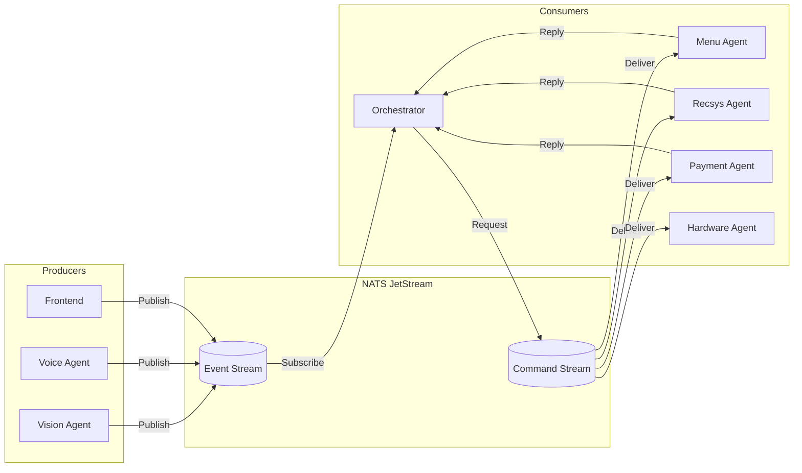

# NATS Event Bus - Component Specification

This document specifies the NATS JetStream event bus component for independent development and integration.

---

## 1. Overview

### 1.1 Purpose
NATS JetStream serves as the **central nervous system** of the kiosk, enabling:
- Decoupled communication between all agents
- Reliable message delivery with persistence
- Request/Reply patterns for synchronous operations
- Pub/Sub patterns for asynchronous events

### 1.2 System Position



---

## 2. Configuration

### 2.1 Server Configuration

```yaml
# nats-server.conf
port: 4222
jetstream: {
  store_dir: "/data/nats"
  max_memory_store: 256MB
  max_file_store: 1GB
}
```

### 2.2 Docker Deployment

```yaml
# docker-compose.yml
services:
  nats:
    image: nats:2.10-alpine
    command: ["-js", "-c", "/etc/nats/nats-server.conf"]
    ports:
      - "4222:4222"   # Client connections
      - "8222:8222"   # Monitoring
    volumes:
      - nats-data:/data/nats
      - ./nats-server.conf:/etc/nats/nats-server.conf
    restart: unless-stopped
```

### 2.3 Connection Settings

| Setting | Value | Reason |
|---------|-------|--------|
| URL | `nats://localhost:4222` | Local deployment |
| Reconnect Wait | 2 seconds | Fast recovery |
| Max Reconnects | -1 (infinite) | Always retry |
| Timeout | 5 seconds | Reasonable for local |

---

## 3. Subject Naming Convention

### 3.1 Pattern

```
kiosk.{domain}.{entity}.{action}
```

### 3.2 Subject Hierarchy

| Pattern | Type | Description |
|---------|------|-------------|
| `kiosk.vision.*` | Pub/Sub | Vision events |
| `kiosk.voice.*` | Pub/Sub | Voice/STT events |
| `kiosk.input.*` | Pub/Sub | User input events |
| `kiosk.agent.{name}.*` | Request/Reply | Agent commands |
| `kiosk.ui.*` | Pub/Sub | UI updates |
| `kiosk.session.*` | Pub/Sub | Session lifecycle |
| `kiosk.hardware.*` | Request/Reply | Hardware commands |

---

## 4. Stream Definitions

### 4.1 Events Stream

Captures all system events for auditing and replay.

```python
# Stream configuration
EVENTS_STREAM = {
    "name": "KIOSK_EVENTS",
    "subjects": [
        "kiosk.vision.>",
        "kiosk.voice.>", 
        "kiosk.input.>",
        "kiosk.session.>",
        "kiosk.ui.>"
    ],
    "retention": "limits",       # Delete old messages
    "max_age": 86400_000_000_000,  # 24 hours in nanoseconds
    "max_msgs": 100000,
    "storage": "file",
    "replicas": 1
}
```

### 4.2 Commands Stream

For agent request/reply patterns with guaranteed delivery.

```python
COMMANDS_STREAM = {
    "name": "KIOSK_COMMANDS",
    "subjects": [
        "kiosk.agent.>",
        "kiosk.hardware.>"
    ],
    "retention": "workqueue",    # Delete after ack
    "max_age": 300_000_000_000,  # 5 minutes
    "storage": "memory",         # Fast, no persistence needed
    "replicas": 1
}
```

---

## 5. Message Specifications

### 5.1 Message Envelope

All messages use this standard envelope:

```json
{
  "msg_id": "string (UUID v4)",
  "timestamp": "string (ISO 8601)",
  "session_id": "string (UUID v4)",
  "trace_id": "string (UUID v4, for distributed tracing)",
  "version": "string (e.g., '1.0')",
  "payload": { }
}
```

### 5.2 Python Data Classes

```python
from dataclasses import dataclass
from datetime import datetime
from typing import Any
import uuid

@dataclass
class NATSMessage:
    msg_id: str
    timestamp: str
    session_id: str
    trace_id: str
    version: str
    payload: dict[str, Any]
    
    @classmethod
    def create(cls, session_id: str, payload: dict, trace_id: str = None):
        return cls(
            msg_id=str(uuid.uuid4()),
            timestamp=datetime.utcnow().isoformat() + "Z",
            session_id=session_id,
            trace_id=trace_id or str(uuid.uuid4()),
            version="1.0",
            payload=payload
        )
```

---

## 6. Event Definitions

### 6.1 Vision Events

#### `kiosk.vision.person_detected`

**Producer:** Vision Agent  
**Consumers:** Orchestrator

```json
{
  "payload": {
    "event": "person_detected",
    "confidence": 0.95,
    "bounding_box": {"x": 100, "y": 50, "w": 200, "h": 400},
    "face_detected": true,
    "estimated_age_group": "adult",
    "estimated_party_size": 2
  }
}
```

#### `kiosk.vision.person_left`

**Producer:** Vision Agent  
**Consumers:** Orchestrator

```json
{
  "payload": {
    "event": "person_left",
    "duration_seconds": 45.5
  }
}
```

#### `kiosk.vision.gaze_detected`

**Producer:** Vision Agent  
**Consumers:** Orchestrator

```json
{
  "payload": {
    "event": "gaze_detected",
    "looking_at_screen": true,
    "gaze_point": {"x": 500, "y": 300}
  }
}
```

---

### 6.2 Voice Events

#### `kiosk.voice.speech_start`

**Producer:** Voice Agent  
**Consumers:** Orchestrator

```json
{
  "payload": {
    "event": "speech_start"
  }
}
```

#### `kiosk.voice.transcript`

**Producer:** Voice Agent  
**Consumers:** Orchestrator

```json
{
  "payload": {
    "event": "transcript",
    "text": "I want a burger with extra cheese",
    "confidence": 0.92,
    "language": "en-US",
    "is_final": true
  }
}
```

#### `kiosk.voice.intent`

**Producer:** Voice Agent  
**Consumers:** Orchestrator

```json
{
  "payload": {
    "event": "intent",
    "intent_type": "search_menu",
    "entities": {
      "item": "burger",
      "modifiers": ["extra cheese"]
    },
    "raw_text": "I want a burger with extra cheese",
    "confidence": 0.88
  }
}
```

---

### 6.3 Input Events (Touch/UI)

#### `kiosk.input.touch`

**Producer:** Frontend (via LiveKit Data Channel → Orchestrator → NATS)  
**Consumers:** Orchestrator

```json
{
  "payload": {
    "event": "touch",
    "action": "select_item",
    "item_id": 101,
    "component": "HeroItem"
  }
}
```

#### `kiosk.input.cart_action`

**Producer:** Frontend  
**Consumers:** Orchestrator

```json
{
  "payload": {
    "event": "cart_action",
    "action": "add" | "remove" | "update_qty",
    "item_id": 101,
    "quantity": 2
  }
}
```

---

### 6.4 Session Events

#### `kiosk.session.started`

**Producer:** Orchestrator  
**Consumers:** All Agents (for initialization)

```json
{
  "payload": {
    "event": "session_started",
    "kiosk_id": "kiosk-001"
  }
}
```

#### `kiosk.session.ended`

**Producer:** Orchestrator  
**Consumers:** All Agents (for cleanup)

```json
{
  "payload": {
    "event": "session_ended",
    "reason": "completed" | "timeout" | "cancelled",
    "duration_seconds": 120.5
  }
}
```

---

### 6.5 UI Events

#### `kiosk.ui.update`

**Producer:** Orchestrator  
**Consumers:** Frontend (bridged via LiveKit Data Channel)

```json
{
  "payload": {
    "event": "ui_update",
    "layout_mode": "hero_grid",
    "theme_override": null,
    "components": [
      {
        "type": "HeroItem",
        "data": {"id": 101, "title": "Volcano Burger"}
      }
    ],
    "suggested_actions": ["Add to cart"]
  }
}
```

---

## 7. Agent Command Specifications (Request/Reply)

### 7.1 Menu Agent

#### `kiosk.agent.menu.search`

**Requester:** Orchestrator  
**Responder:** Menu Agent  
**Timeout:** 2 seconds

**Request:**
```json
{
  "payload": {
    "command": "search",
    "query": "spicy burger",
    "tags": ["spicy"],
    "dietary_filters": ["vegetarian"],
    "limit": 10
  }
}
```

**Response:**
```json
{
  "payload": {
    "status": "success",
    "items": [
      {
        "id": 101,
        "name": "Volcano Burger",
        "price": 12.99,
        "image": "/img/volcano.png",
        "tags": ["spicy", "popular"],
        "available": true
      }
    ],
    "total_matches": 5
  }
}
```

#### `kiosk.agent.menu.details`

**Request:**
```json
{
  "payload": {
    "command": "get_details",
    "item_id": 101
  }
}
```

**Response:**
```json
{
  "payload": {
    "status": "success",
    "item": {
      "id": 101,
      "name": "Volcano Burger",
      "description": "Spicy beef patty with jalapeños...",
      "price": 12.99,
      "calories": 850,
      "allergens": ["gluten", "dairy"],
      "customizations": [
        {"name": "Extra Cheese", "price": 1.50},
        {"name": "No Onions", "price": 0}
      ]
    }
  }
}
```

---

### 7.2 Recommendation Agent

#### `kiosk.agent.recsys.suggest`

**Requester:** Orchestrator  
**Responder:** Recommendation Agent  
**Timeout:** 2 seconds

**Request:**
```json
{
  "payload": {
    "command": "suggest",
    "cart": [
      {"item_id": 101, "quantity": 1}
    ],
    "context": {
      "time_of_day": "lunch",
      "weather": "hot",
      "party_size": 2
    }
  }
}
```

**Response:**
```json
{
  "payload": {
    "status": "success",
    "suggestions": [
      {
        "item_id": 201,
        "name": "Iced Cola",
        "pitch": "Perfect to cool down with your burger!",
        "reason": "weather_hot"
      },
      {
        "item_id": 301,
        "name": "Fries Combo",
        "pitch": "Make it a combo and save $2!",
        "reason": "upsell_combo"
      }
    ]
  }
}
```

---

### 7.3 Payment Agent

#### `kiosk.agent.payment.process`

**Requester:** Orchestrator  
**Responder:** Payment Agent  
**Timeout:** 30 seconds (card tap waiting)

**Request:**
```json
{
  "payload": {
    "command": "process_payment",
    "order_id": "order-uuid",
    "total": 24.99,
    "items": [
      {"item_id": 101, "name": "Volcano Burger", "qty": 1, "price": 12.99},
      {"item_id": 201, "name": "Iced Cola", "qty": 2, "price": 5.99}
    ],
    "loyalty_card": "LOYALTY123"
  }
}
```

**Response:**
```json
{
  "payload": {
    "status": "success" | "failed" | "cancelled",
    "transaction_id": "txn-uuid",
    "amount_charged": 24.99,
    "loyalty_points_earned": 25,
    "receipt_url": "/receipts/txn-uuid.pdf",
    "error": null
  }
}
```

---

### 7.4 Hardware Agent

#### `kiosk.agent.hardware.led`

**Requester:** Orchestrator  
**Responder:** Hardware Agent  
**Timeout:** 1 second

**Request:**
```json
{
  "payload": {
    "command": "set_led",
    "color": "#00FF00",
    "pattern": "solid" | "pulse" | "error",
    "duration_ms": 2000
  }
}
```

**Response:**
```json
{
  "payload": {
    "status": "success"
  }
}
```

#### `kiosk.agent.hardware.print`

**Request:**
```json
{
  "payload": {
    "command": "print_receipt",
    "order_id": "order-uuid",
    "items": [...],
    "total": 24.99,
    "transaction_id": "txn-uuid"
  }
}
```

---

## 8. Error Handling

### 8.1 Error Response Format

All agents return errors in this format:

```json
{
  "payload": {
    "status": "error",
    "error_code": "MENU_NOT_FOUND",
    "error_message": "No items match the search query",
    "retryable": false
  }
}
```

### 8.2 Error Codes

| Code | Meaning | Retryable |
|------|---------|-----------|
| `TIMEOUT` | Agent did not respond | ✅ Yes |
| `UNAVAILABLE` | Agent not running | ✅ Yes |
| `MENU_NOT_FOUND` | No search results | ❌ No |
| `ITEM_OUT_OF_STOCK` | Item unavailable | ❌ No |
| `PAYMENT_DECLINED` | Card declined | ✅ Yes (retry) |
| `PAYMENT_TIMEOUT` | No card tap | ✅ Yes |
| `HARDWARE_ERROR` | Peripheral failure | ❌ No |

---

## 9. Consumer Groups

### 9.1 Purpose
Consumer groups enable horizontal scaling of agents. Multiple instances of an agent share the workload.

### 9.2 Configuration

```python
# Consumer configuration per agent
CONSUMER_CONFIG = {
    "menu_agent": {
        "durable_name": "menu-agent-consumer",
        "deliver_policy": "all",
        "ack_policy": "explicit",
        "max_deliver": 3,
        "ack_wait": 5_000_000_000,  # 5 seconds in nanoseconds
    },
    "payment_agent": {
        "durable_name": "payment-agent-consumer",
        "deliver_policy": "all",
        "ack_policy": "explicit",
        "max_deliver": 1,  # No retries for payment
        "ack_wait": 30_000_000_000,  # 30 seconds
    }
}
```

---

## 10. Integration Interface

### 10.1 Python Client Wrapper

Each agent should implement this interface:

```python
from abc import ABC, abstractmethod
from nats.aio.client import Client

class NATSAgentBase(ABC):
    def __init__(self, nats_url: str = "nats://localhost:4222"):
        self.nc: Client = None
        self.js = None  # JetStream context
        
    async def connect(self):
        """Connect to NATS and initialize JetStream."""
        self.nc = await nats_connect(self.nats_url)
        self.js = self.nc.jetstream()
        await self._setup_subscriptions()
    
    @abstractmethod
    async def _setup_subscriptions(self):
        """Subscribe to relevant subjects."""
        pass
    
    @abstractmethod
    async def handle_message(self, msg):
        """Process incoming message."""
        pass
    
    async def publish(self, subject: str, payload: dict):
        """Publish event to NATS."""
        message = NATSMessage.create(self.session_id, payload)
        await self.js.publish(subject, message.to_json().encode())
    
    async def request(self, subject: str, payload: dict, timeout: float = 5.0):
        """Send request and wait for reply."""
        message = NATSMessage.create(self.session_id, payload)
        response = await self.nc.request(
            subject, 
            message.to_json().encode(), 
            timeout=timeout
        )
        return json.loads(response.data.decode())
```

### 10.2 Testing Independently

```bash
# 1. Start NATS locally
docker run -d --name nats -p 4222:4222 nats:alpine -js

# 2. Test publish (using nats CLI)
nats pub kiosk.vision.person_detected '{"msg_id":"test","payload":{"event":"person_detected"}}'

# 3. Test subscribe
nats sub "kiosk.>"

# 4. Test request/reply
nats reply kiosk.agent.menu.search '{"payload":{"status":"success","items":[]}}'
nats req kiosk.agent.menu.search '{"payload":{"command":"search","query":"burger"}}'
```

---

## 11. Monitoring

### 11.1 Health Check Endpoint

```
GET http://localhost:8222/healthz
```

### 11.2 Key Metrics

| Metric | Description | Alert Threshold |
|--------|-------------|-----------------|
| `nats_msgs_received` | Messages per second | - |
| `nats_slow_consumers` | Consumers falling behind | > 0 |
| `nats_jetstream_bytes` | Storage used | > 500MB |
| `kiosk_agent_latency_ms` | Request/reply time | > 2000ms |

---

## 12. Development Checklist

### For Independent Development

- [ ] Install NATS server (Docker or native)
- [ ] Implement `NATSAgentBase` interface
- [ ] Subscribe to relevant subjects
- [ ] Implement message handlers
- [ ] Return properly formatted responses
- [ ] Add error handling with standard error codes
- [ ] Test with NATS CLI tools
- [ ] Add health check endpoint

### For Integration

- [ ] Verify subject naming matches specification
- [ ] Verify message envelope format
- [ ] Test timeout handling
- [ ] Test retry behavior
- [ ] Verify consumer group configuration
- [ ] Run end-to-end flow tests
