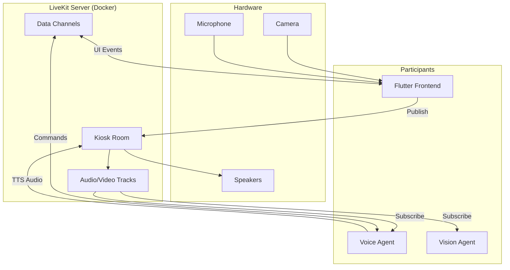
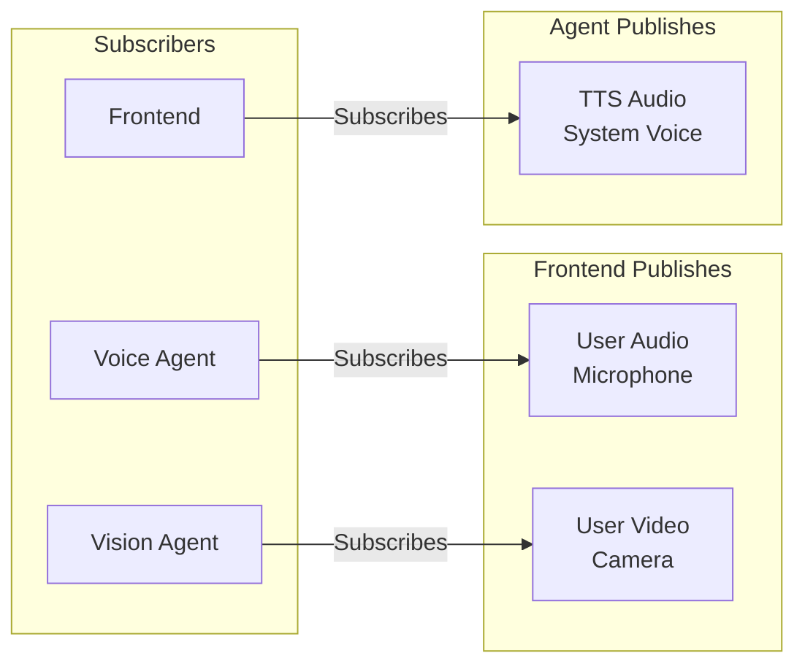

# LiveKit - Component Specification

This document specifies the LiveKit component for real-time audio/video streaming.

---

## 1. Overview

### 1.1 Purpose
LiveKit provides the **real-time communication layer** for the kiosk:
- WebRTC-based audio/video streaming
- Data channels for low-latency messaging
- Voice Activity Detection (VAD)
- Backend agent integration via `livekit-agents`

### 1.2 System Position



---

## 2. Configuration

### 2.1 Server Configuration

```yaml
# livekit.yaml
port: 7880
rtc:
  port_range_start: 50000
  port_range_end: 50200
  use_external_ip: false
  
keys:
  # For local development only - use env vars in production
  devkey: secret

logging:
  level: info
```

### 2.2 Docker Deployment

```yaml
# docker-compose.yml
services:
  livekit:
    image: livekit/livekit-server:v1.5
    ports:
      - "7880:7880"    # HTTP/WebSocket
      - "7881:7881"    # RTC (TCP)
      - "50000-50200:50000-50200/udp"  # RTC (UDP)
    environment:
      - LIVEKIT_KEYS=devkey: secret
    volumes:
      - ./livekit.yaml:/etc/livekit.yaml
    command: ["--config", "/etc/livekit.yaml"]
    restart: unless-stopped
```

### 2.3 Resource Requirements

| Resource | Allocation | Notes |
|----------|------------|-------|
| RAM | ~200MB | Base server memory |
| CPU | 1 core | Sufficient for single room |
| Network | 10 Mbps | Local loopback, minimal |
| Ports | 7880, 7881, 50000-50200 | HTTP, TCP, UDP RTC |

---

## 3. Room Architecture

### 3.1 Room Per Session

Each kiosk session creates a dedicated room:

```
Room Name: kiosk-{kiosk_id}-{session_id}
Example:   kiosk-001-abc123
```

### 3.2 Participant Roles

| Participant | Identity | Role | Tracks Published |
|-------------|----------|------|------------------|
| Flutter Frontend | `frontend` | User interface | Camera, Microphone |
| Voice Agent | `voice-agent` | STT/TTS processing | TTS Audio |
| Vision Agent | `vision-agent` | CV processing | None |
| Debug Client | `debug-{user}` | Remote debugging | None |

### 3.3 Track Types



---

## 4. Track Specifications

### 4.1 User Audio Track

| Property | Value |
|----------|-------|
| Type | `audio` |
| Source | Microphone |
| Codec | Opus |
| Sample Rate | 48kHz |
| Channels | Mono |
| Bitrate | 32kbps |

### 4.2 User Video Track

| Property | Value |
|----------|-------|
| Type | `video` |
| Source | Camera |
| Codec | VP8 or H.264 |
| Resolution | 640x480 |
| Frame Rate | 15 fps |
| Bitrate | 500kbps |

> [!TIP]
> Low resolution (640x480) is sufficient for face detection and reduces bandwidth.

### 4.3 TTS Audio Track

| Property | Value |
|----------|-------|
| Type | `audio` |
| Source | Voice Agent (NVIDIA Riva TTS) |
| Codec | Opus |
| Sample Rate | 24kHz |
| Channels | Mono |

---

## 5. Data Channel Protocol

### 5.1 Purpose
Data channels provide low-latency bidirectional messaging between Frontend and Backend, replacing Socket.IO.

### 5.2 Message Format

```json
{
  "type": "string",
  "payload": { },
  "timestamp": "ISO 8601",
  "session_id": "string"
}
```

### 5.3 Message Types

#### Frontend → Backend

| Type | Description | Payload |
|------|-------------|---------|
| `touch.select_item` | User taps item | `{ "item_id": 101 }` |
| `touch.action` | User taps action button | `{ "action": "checkout" }` |
| `cart.add` | Add item to cart | `{ "item_id": 101, "qty": 1 }` |
| `cart.remove` | Remove from cart | `{ "item_id": 101 }` |
| `session.ping` | Keep-alive heartbeat | `{}` |

#### Backend → Frontend

| Type | Description | Payload |
|------|-------------|---------|
| `ui.update` | New UI state | GenUI JSON (see below) |
| `ui.notification` | Toast message | `{ "text": "...", "type": "info" }` |
| `session.state` | State change | `{ "state": "LISTENING" }` |
| `tts.start` | TTS audio starting | `{ "text": "..." }` |
| `tts.end` | TTS audio complete | `{}` |

### 5.4 GenUI Payload (ui.update)

```json
{
  "type": "ui.update",
  "payload": {
    "layout_mode": "hero_grid",
    "theme_override": null,
    "components": [
      {
        "type": "HeroItem",
        "data": { "id": 101, "title": "Volcano Burger", "image": "/img/burger.png" }
      }
    ],
    "cart": {
      "items": [{"id": 101, "qty": 1, "price": 12.99}],
      "total": 12.99
    },
    "suggested_actions": [
      {"label": "Add to cart", "action": "cart.add", "item_id": 101}
    ]
  }
}
```

---

## 6. LiveKit Agents Integration

### 6.1 Python Agent Framework

```python
from livekit import agents, rtc
from livekit.agents import JobContext, WorkerOptions

class VoiceAgentWorker:
    def __init__(self, ctx: JobContext):
        self.ctx = ctx
        self.room = ctx.room
        
    async def start(self):
        # Subscribe to user audio
        @self.room.on("track_subscribed")
        async def on_track(track: rtc.Track, publication, participant):
            if track.kind == rtc.TrackKind.KIND_AUDIO:
                await self.process_audio(track)
    
    async def process_audio(self, track: rtc.AudioTrack):
        """Process audio with NVIDIA Riva STT."""
        async for frame in rtc.AudioStream(track):
            # Send to Riva for transcription
            pass
    
    async def publish_tts(self, text: str):
        """Generate TTS and publish to room."""
        audio_frames = await self.riva_tts(text)
        source = rtc.AudioSource(24000, 1)
        track = rtc.LocalAudioTrack.create_audio_track("tts", source)
        await self.room.local_participant.publish_track(track)
        
        for frame in audio_frames:
            await source.capture_frame(frame)

# Worker entry point
async def entrypoint(ctx: JobContext):
    worker = VoiceAgentWorker(ctx)
    await worker.start()

if __name__ == "__main__":
    agents.cli.run_app(WorkerOptions(entrypoint_fnc=entrypoint))
```

### 6.2 Agent Registration

```bash
# Start voice agent worker
python voice_agent.py start \
  --url ws://localhost:7880 \
  --api-key devkey \
  --api-secret secret
```

---

## 7. Flutter Integration

### 7.1 Dependencies

```yaml
# pubspec.yaml
dependencies:
  livekit_client: ^2.0.0
```

### 7.2 Connection Flow

```dart
import 'package:livekit_client/livekit_client.dart';

class LiveKitService {
  late Room room;
  late LocalParticipant localParticipant;
  
  Future<void> connect(String sessionId) async {
    final roomOptions = RoomOptions(
      adaptiveStream: true,
      dynacast: true,
    );
    
    room = Room();
    
    // Get token from backend
    final token = await _fetchToken(sessionId);
    
    await room.connect(
      'ws://localhost:7880',
      token,
      roomOptions: roomOptions,
    );
    
    localParticipant = room.localParticipant!;
  }
  
  Future<void> publishCamera() async {
    await localParticipant.setCameraEnabled(true);
  }
  
  Future<void> publishMicrophone() async {
    await localParticipant.setMicrophoneEnabled(true);
  }
  
  void onDataReceived(Function(String) callback) {
    room.on<DataReceivedEvent>((event) {
      final message = String.fromCharCodes(event.data);
      callback(message);
    });
  }
  
  Future<void> sendData(String message) async {
    await localParticipant.publishData(
      utf8.encode(message),
      reliable: true,
    );
  }
}
```

### 7.3 Audio Playback

```dart
// TTS audio from Voice Agent is automatically played
// when subscribed to the track

room.on<TrackSubscribedEvent>((event) {
  if (event.track.kind == TrackType.AUDIO) {
    // Audio plays automatically through speakers
    print('TTS audio track subscribed');
  }
});
```

---

## 8. Error Handling

### 8.1 Connection Errors

| Error | Cause | Recovery |
|-------|-------|----------|
| `ConnectionError` | Server unreachable | Retry with backoff |
| `AuthError` | Invalid token | Re-fetch token |
| `RoomNotFound` | Room closed | Create new session |

### 8.2 Track Errors

| Error | Cause | Recovery |
|-------|-------|----------|
| `PermissionDenied` | Camera/mic blocked | Show permission UI |
| `DeviceNotFound` | Hardware missing | Fall back to touch-only |
| `TrackPublishFailed` | Network issue | Retry |

---

## 9. Monitoring

### 9.1 Metrics Endpoint

```
GET http://localhost:7880/debug/pprof/
```

### 9.2 Key Metrics

| Metric | Description | Alert Threshold |
|--------|-------------|-----------------|
| `rooms_active` | Active rooms | > 1 (should be 1) |
| `participants_count` | Total participants | > 5 (unusual) |
| `packet_loss` | RTC packet loss | > 5% |
| `round_trip_time_ms` | Network latency | > 100ms |

---

## 10. Testing

### 10.1 Local Testing Tools

```bash
# 1. Start LiveKit server
docker-compose up livekit

# 2. Generate test token
docker exec -it livekit livekit-cli create-token \
  --api-key devkey --api-secret secret \
  --join --room test-room --identity test-user

# 3. Connect with CLI
livekit-cli join-room \
  --url ws://localhost:7880 \
  --token <TOKEN>
```

### 10.2 Integration Test Checklist

- [ ] Frontend can connect to room
- [ ] Camera track publishes successfully
- [ ] Microphone track publishes successfully
- [ ] Voice Agent receives audio track
- [ ] Vision Agent receives video track
- [ ] TTS audio plays on Frontend
- [ ] Data channels work bidirectionally
- [ ] Room cleanup on session end

---

## 11. Development Checklist

### For Independent Development

- [ ] Run LiveKit server in Docker
- [ ] Generate access tokens
- [ ] Implement track publishing (Flutter)
- [ ] Implement track subscription (Python agents)
- [ ] Implement data channel messaging
- [ ] Handle connection errors
- [ ] Test with multiple participants

### For Integration

- [ ] Coordinate room naming with Orchestrator
- [ ] Sync data channel message types with NATS events
- [ ] Verify TTS playback quality
- [ ] Test VAD sensitivity
- [ ] Load test with realistic session length
