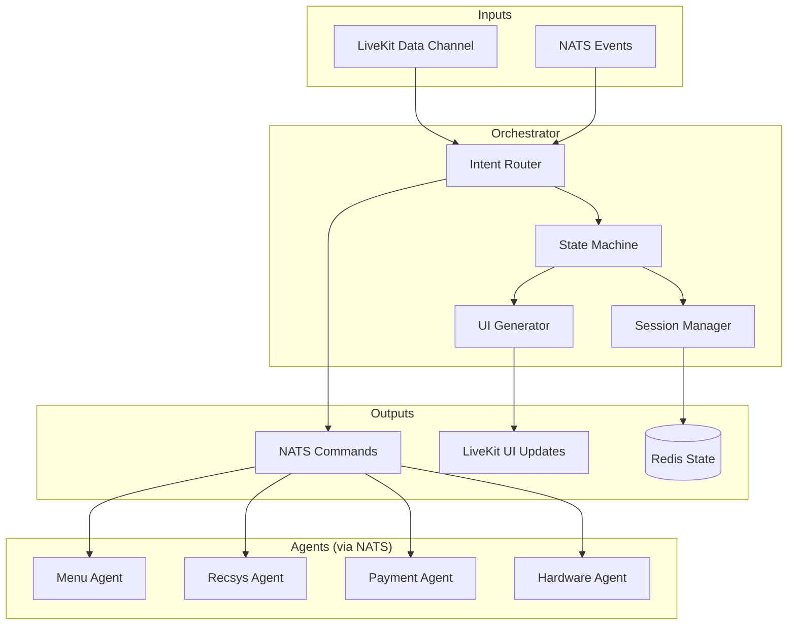
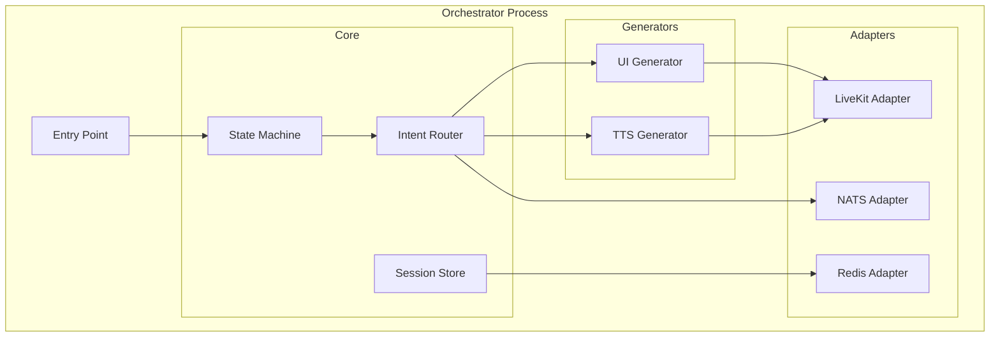
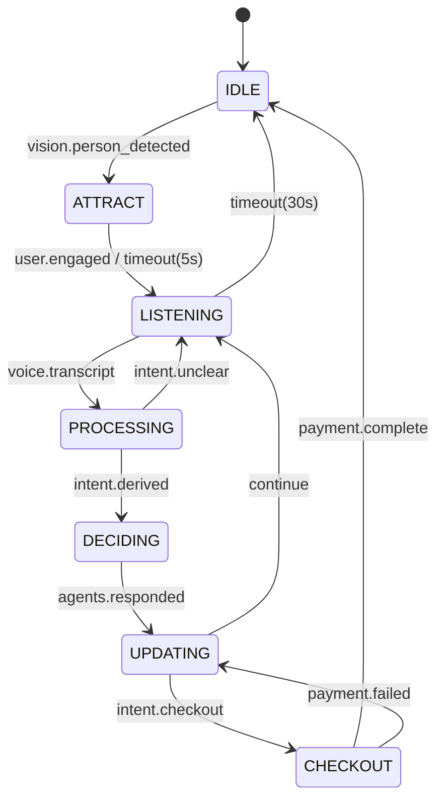

# Orchestrator - Component Specification

This document specifies the Orchestrator component, the central brain of the kiosk system.

---

## 1. Overview

### 1.1 Purpose
The Orchestrator is the **central coordinator** that:
- Manages session state and lifecycle
- Routes inputs to appropriate agents
- Synthesizes agent responses into UI updates
- Controls the state machine transitions
- Bridges LiveKit data channels to NATS

### 1.2 System Position



---

## 2. Architecture

### 2.1 Internal Components



### 2.2 Technology Stack

| Component | Technology |
|-----------|------------|
| Language | Python 3.11+ |
| Framework | LangGraph |
| Async | asyncio |
| LiveKit | livekit-agents SDK |
| NATS | nats-py |
| Redis | redis-py / aioredis |

---

## 3. State Machine

### 3.1 States

```python
from enum import Enum

class KioskState(Enum):
    IDLE = "idle"
    ATTRACT = "attract"
    LISTENING = "listening"
    PROCESSING = "processing"
    DECIDING = "deciding"
    UPDATING = "updating"
    CHECKOUT = "checkout"
```

### 3.2 Transitions



### 3.3 State Implementation

```python
from langgraph.graph import StateGraph, END

def build_orchestrator_graph():
    graph = StateGraph(SessionState)
    
    # Add nodes
    graph.add_node("idle", idle_handler)
    graph.add_node("attract", attract_handler)
    graph.add_node("listening", listening_handler)
    graph.add_node("processing", processing_handler)
    graph.add_node("deciding", deciding_handler)
    graph.add_node("updating", updating_handler)
    graph.add_node("checkout", checkout_handler)
    
    # Add edges
    graph.add_conditional_edges(
        "idle",
        route_from_idle,
        {"attract": "attract", "idle": "idle"}
    )
    graph.add_conditional_edges(
        "attract",
        route_from_attract,
        {"listening": "listening", "idle": "idle"}
    )
    # ... more edges
    
    graph.set_entry_point("idle")
    return graph.compile()
```

---

## 4. Session Management

### 4.1 Session State Schema

```python
from dataclasses import dataclass, field
from datetime import datetime
from typing import Optional

@dataclass
class CartItem:
    item_id: int
    name: str
    quantity: int
    price: float
    customizations: list[str] = field(default_factory=list)

@dataclass
class SessionState:
    # Identity
    session_id: str
    kiosk_id: str
    
    # State
    current_state: KioskState = KioskState.IDLE
    
    # Timing
    started_at: Optional[datetime] = None
    last_activity: Optional[datetime] = None
    
    # User Context
    demographics: dict = field(default_factory=dict)
    dietary_restrictions: list[str] = field(default_factory=list)
    
    # Cart
    cart: list[CartItem] = field(default_factory=list)
    
    # Conversation
    conversation_history: list[dict] = field(default_factory=list)
    pending_intent: Optional[dict] = None
    
    # UI State
    current_ui: Optional[dict] = None
    
    @property
    def cart_total(self) -> float:
        return sum(item.price * item.quantity for item in self.cart)
```

### 4.2 Redis Storage

```python
import redis.asyncio as redis
import json

class SessionStore:
    def __init__(self, redis_url: str = "redis://localhost:6379"):
        self.redis = redis.from_url(redis_url)
        self.ttl = 300  # 5 minutes
    
    async def save(self, session: SessionState):
        key = f"session:{session.session_id}"
        await self.redis.setex(
            key,
            self.ttl,
            json.dumps(session.to_dict())
        )
    
    async def load(self, session_id: str) -> Optional[SessionState]:
        key = f"session:{session_id}"
        data = await self.redis.get(key)
        if data:
            return SessionState.from_dict(json.loads(data))
        return None
    
    async def refresh(self, session_id: str):
        key = f"session:{session_id}"
        await self.redis.expire(key, self.ttl)
    
    async def delete(self, session_id: str):
        key = f"session:{session_id}"
        await self.redis.delete(key)
```

---

## 5. Input Handling

### 5.1 Input Sources

| Source | Transport | Events |
|--------|-----------|--------|
| Frontend (touch) | LiveKit Data Channel | `touch.*`, `cart.*` |
| Voice Agent | NATS | `kiosk.voice.*` |
| Vision Agent | NATS | `kiosk.vision.*` |

### 5.2 Input Router

```python
class InputRouter:
    def __init__(self, state_machine, agents: AgentProxy):
        self.sm = state_machine
        self.agents = agents
    
    async def handle_input(self, event: dict, session: SessionState):
        event_type = event.get("type")
        
        match event_type:
            # Vision events
            case "vision.person_detected":
                await self.sm.transition(session, "attract")
            
            case "vision.person_left":
                await self.sm.transition(session, "idle")
            
            # Voice events
            case "voice.transcript":
                session.pending_intent = await self._derive_intent(
                    event["payload"]["text"]
                )
                await self.sm.transition(session, "processing")
            
            case "voice.intent":
                session.pending_intent = event["payload"]
                await self.sm.transition(session, "deciding")
            
            # Touch events
            case "touch.select_item":
                item = await self.agents.menu.get_details(
                    event["payload"]["item_id"]
                )
                session.current_ui = self._generate_item_detail(item)
                await self.sm.transition(session, "updating")
            
            case "cart.add":
                self._add_to_cart(session, event["payload"])
                await self.sm.transition(session, "updating")
    
    async def _derive_intent(self, text: str) -> dict:
        """Use Gemini to extract intent from text."""
        # Call Gemini for intent extraction
        pass
```

---

## 6. Agent Communication

### 6.1 Agent Proxy

```python
class AgentProxy:
    def __init__(self, nats_client):
        self.nc = nats_client
        self.timeout = 5.0
    
    async def request(self, subject: str, payload: dict) -> dict:
        msg = NATSMessage.create(self.session_id, payload)
        response = await self.nc.request(
            subject,
            msg.to_json().encode(),
            timeout=self.timeout
        )
        return json.loads(response.data.decode())
    
    @property
    def menu(self) -> MenuAgentProxy:
        return MenuAgentProxy(self)
    
    @property
    def recsys(self) -> RecsysAgentProxy:
        return RecsysAgentProxy(self)
    
    @property
    def payment(self) -> PaymentAgentProxy:
        return PaymentAgentProxy(self)

class MenuAgentProxy:
    def __init__(self, proxy: AgentProxy):
        self.proxy = proxy
    
    async def search(self, query: str, tags: list = None) -> list:
        result = await self.proxy.request(
            "kiosk.agent.menu.search",
            {"command": "search", "query": query, "tags": tags or []}
        )
        return result["payload"]["items"]
    
    async def get_details(self, item_id: int) -> dict:
        result = await self.proxy.request(
            "kiosk.agent.menu.details",
            {"command": "get_details", "item_id": item_id}
        )
        return result["payload"]["item"]
```

### 6.2 Parallel Agent Calls

```python
async def handle_menu_search(session: SessionState, query: str):
    """Execute menu search and get recommendations in parallel."""
    
    async with asyncio.TaskGroup() as tg:
        menu_task = tg.create_task(
            agents.menu.search(query, session.dietary_restrictions)
        )
        recsys_task = tg.create_task(
            agents.recsys.suggest(session.cart)
        )
    
    menu_items = menu_task.result()
    suggestions = recsys_task.result()
    
    return {
        "items": menu_items,
        "suggestions": suggestions
    }
```

---

## 7. UI Generation

### 7.1 UI State Generator

```python
class UIGenerator:
    def generate(self, session: SessionState, context: dict) -> dict:
        """Generate GenUI JSON from session state and context."""
        
        components = []
        
        # Main content based on context
        if "items" in context:
            components.extend(self._generate_item_grid(context["items"]))
        
        # Always include cart summary
        components.append(self._generate_cart_summary(session.cart))
        
        # Add suggestions
        if "suggestions" in context:
            components.append(self._generate_suggestions(context["suggestions"]))
        
        return {
            "layout_mode": self._determine_layout(context),
            "theme_override": None,
            "components": components,
            "suggested_actions": self._generate_actions(session),
            "cart": {
                "items": [item.to_dict() for item in session.cart],
                "total": session.cart_total
            }
        }
    
    def _generate_item_grid(self, items: list) -> list:
        if len(items) == 1:
            return [{"type": "HeroItem", "data": items[0]}]
        return [{"type": "ItemGrid", "items": items[:9]}]
    
    def _generate_cart_summary(self, cart: list) -> dict:
        return {
            "type": "CartSummary",
            "data": {
                "item_count": sum(item.quantity for item in cart),
                "total": sum(item.price * item.quantity for item in cart)
            }
        }
```

### 7.2 TTS Response Generation

```python
class TTSGenerator:
    async def generate(self, session: SessionState, context: dict) -> str:
        """Generate natural language response for TTS."""
        
        prompt = f"""
        Generate a brief, friendly response for a food kiosk.
        
        Context:
        - Cart items: {len(session.cart)}
        - Just showed: {context.get('shown_items', [])}
        - Suggestions: {context.get('suggestions', [])}
        
        Requirements:
        - Maximum 2 sentences
        - Casual, friendly tone
        - Mention specific item names if relevant
        """
        
        response = await self.gemini.generate_content(prompt)
        return response.text
```

---

## 8. LiveKit Integration

### 8.1 Data Channel Bridge

```python
from livekit import agents, rtc

class OrchestratorAgent:
    def __init__(self, ctx: agents.JobContext):
        self.ctx = ctx
        self.room = ctx.room
        self.session_store = SessionStore()
        self.graph = build_orchestrator_graph()
    
    async def start(self):
        # Listen for data channel messages from Frontend
        @self.room.on("data_received")
        async def on_data(data: bytes, participant: rtc.Participant):
            message = json.loads(data.decode())
            await self.handle_frontend_message(message)
        
        # Subscribe to NATS events
        await self.subscribe_nats_events()
    
    async def handle_frontend_message(self, message: dict):
        session = await self.session_store.load(self.session_id)
        
        # Route through state machine
        await self.router.handle_input(message, session)
        
        # Save updated state
        await self.session_store.save(session)
        
        # Send UI update back to frontend
        await self.send_ui_update(session)
    
    async def send_ui_update(self, session: SessionState):
        ui_json = self.ui_generator.generate(session, self.context)
        
        await self.room.local_participant.publish_data(
            json.dumps({
                "type": "ui.update",
                "payload": ui_json
            }).encode(),
            reliable=True
        )
```

---

## 9. Error Handling

### 9.1 Circuit Breaker for Gemini

```python
from circuitbreaker import circuit

class GeminiClient:
    @circuit(failure_threshold=5, recovery_timeout=30)
    async def generate_intent(self, text: str) -> dict:
        try:
            response = await self.model.generate_content_async(
                self._build_intent_prompt(text),
                generation_config={"response_mime_type": "application/json"}
            )
            return json.loads(response.text)
        except Exception as e:
            # Fallback to keyword matching
            return self._keyword_fallback(text)
    
    def _keyword_fallback(self, text: str) -> dict:
        """Simple keyword-based intent detection."""
        text_lower = text.lower()
        
        if any(word in text_lower for word in ["burger", "pizza", "chicken"]):
            return {"intent": "search_menu", "query": text}
        if any(word in text_lower for word in ["pay", "checkout", "done"]):
            return {"intent": "checkout"}
        
        return {"intent": "unknown", "text": text}
```

### 9.2 Agent Timeout Handling

```python
async def safe_agent_call(coro, timeout: float, fallback: dict):
    """Execute agent call with timeout and fallback."""
    try:
        return await asyncio.wait_for(coro, timeout=timeout)
    except asyncio.TimeoutError:
        logger.warning(f"Agent timeout, using fallback")
        return fallback
    except Exception as e:
        logger.error(f"Agent error: {e}")
        return fallback
```

---

## 10. Configuration

### 10.1 Environment Variables

```bash
# .env
KIOSK_ID=kiosk-001
NATS_URL=nats://localhost:4222
REDIS_URL=redis://localhost:6379
LIVEKIT_URL=ws://localhost:7880
LIVEKIT_API_KEY=devkey
LIVEKIT_API_SECRET=secret
GEMINI_API_KEY=your-api-key
```

### 10.2 Configuration Schema

```python
from pydantic import BaseSettings

class OrchestratorConfig(BaseSettings):
    kiosk_id: str = "kiosk-001"
    
    # Connections
    nats_url: str = "nats://localhost:4222"
    redis_url: str = "redis://localhost:6379"
    livekit_url: str = "ws://localhost:7880"
    livekit_api_key: str
    livekit_api_secret: str
    gemini_api_key: str
    
    # Timeouts
    session_timeout: int = 300  # 5 minutes
    agent_timeout: float = 5.0
    idle_timeout: int = 30
    
    # Gemini
    gemini_model: str = "gemini-2.0-flash"
    
    class Config:
        env_prefix = ""
        env_file = ".env"
```

---

## 11. Entry Point

```python
# orchestrator/main.py
import asyncio
from livekit import agents

from .config import OrchestratorConfig
from .agent import OrchestratorAgent

async def entrypoint(ctx: agents.JobContext):
    config = OrchestratorConfig()
    agent = OrchestratorAgent(ctx, config)
    await agent.start()

def main():
    agents.cli.run_app(
        agents.WorkerOptions(
            entrypoint_fnc=entrypoint,
            api_key=OrchestratorConfig().livekit_api_key,
            api_secret=OrchestratorConfig().livekit_api_secret,
            ws_url=OrchestratorConfig().livekit_url,
        )
    )

if __name__ == "__main__":
    main()
```

---

## 12. Testing

### 12.1 Unit Test Example

```python
import pytest
from orchestrator.state import SessionState, KioskState
from orchestrator.router import InputRouter

@pytest.fixture
def session():
    return SessionState(
        session_id="test-session",
        kiosk_id="test-kiosk"
    )

async def test_vision_triggers_attract(session, router):
    event = {"type": "vision.person_detected", "payload": {}}
    await router.handle_input(event, session)
    assert session.current_state == KioskState.ATTRACT

async def test_cart_add(session, router):
    event = {
        "type": "cart.add",
        "payload": {"item_id": 101, "quantity": 1}
    }
    await router.handle_input(event, session)
    assert len(session.cart) == 1
```

---

## 13. Development Checklist

### For Independent Development

- [ ] Implement state machine with LangGraph
- [ ] Implement session store with Redis
- [ ] Implement input router
- [ ] Implement agent proxies
- [ ] Implement UI generator
- [ ] Implement TTS generator
- [ ] Add Gemini integration with circuit breaker
- [ ] Add error handling and fallbacks

### For Integration

- [ ] Connect to NATS for agent communication
- [ ] Connect to LiveKit for frontend communication
- [ ] Verify state persistence in Redis
- [ ] Test full flow from vision → checkout
- [ ] Load test session management
- [ ] Verify timeout handling
