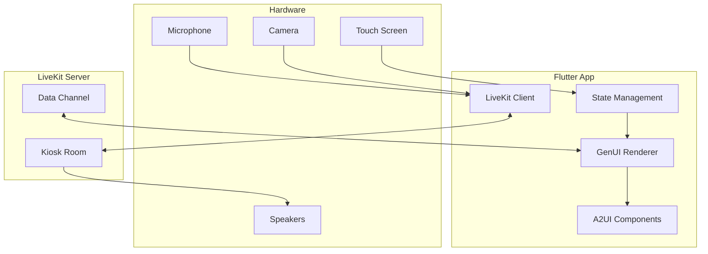

# Frontend - Component Specification

This document specifies the Flutter frontend with A2UI and Generative UI (GenUI) capabilities.

---

## 1. Overview

### 1.1 Purpose
The Flutter frontend serves as the **user interface layer**:
- Renders dynamic Generative UI from backend JSON
- Captures user touch interactions
- Manages camera and microphone streams via LiveKit
- Plays TTS audio from the Voice Agent

### 1.2 Technology Choice: Flutter over Next.js

| Criteria | Flutter | Next.js |
|----------|---------|---------|
| Performance | Native-like (Skia) | Browser-based |
| Kiosk Mode | Native support | Chromium wrapper |
| Offline | Full support | Limited |
| Camera/Mic | Direct hardware | WebRTC only |
| Bundle Size | ~15MB | Browser + ~5MB |
| Cross-platform | Mobile/Desktop/Web | Web only |

> [!IMPORTANT]
> Flutter provides better kiosk performance and native hardware access on Jetson.

### 1.3 System Position



---

## 2. Architecture

### 2.1 Layer Architecture

```
┌─────────────────────────────────────────┐
│           Presentation Layer            │
│  (A2UI Components, Animations, Themes)  │
├─────────────────────────────────────────┤
│           GenUI Renderer Layer          │
│  (JSON → Widget Tree Transformation)    │
├─────────────────────────────────────────┤
│           State Management Layer        │
│  (Riverpod / Bloc for reactive state)   │
├─────────────────────────────────────────┤
│           Communication Layer           │
│  (LiveKit Client, Data Channels)        │
├─────────────────────────────────────────┤
│           Platform Layer                │
│  (Camera, Audio, Touch Input)           │
└─────────────────────────────────────────┘
```

### 2.2 Project Structure

```
lib/
├── main.dart
├── app.dart
│
├── core/
│   ├── config/
│   │   └── app_config.dart
│   ├── theme/
│   │   ├── app_theme.dart
│   │   └── a2ui_theme.dart
│   └── utils/
│       └── logger.dart
│
├── features/
│   ├── kiosk/
│   │   ├── presentation/
│   │   │   ├── screens/
│   │   │   │   └── kiosk_screen.dart
│   │   │   └── widgets/
│   │   └── providers/
│   │       └── kiosk_provider.dart
│   │
│   └── cart/
│       ├── domain/
│       │   └── cart_item.dart
│       └── presentation/
│
├── genui/
│   ├── renderer.dart
│   ├── components/
│   │   ├── hero_item.dart
│   │   ├── item_grid.dart
│   │   ├── carousel.dart
│   │   ├── cart_summary.dart
│   │   └── action_bar.dart
│   └── models/
│       └── ui_state.dart
│
├── a2ui/
│   ├── buttons/
│   ├── cards/
│   ├── animations/
│   └── layouts/
│
└── services/
    ├── livekit_service.dart
    ├── audio_service.dart
    └── session_service.dart
```

---

## 3. A2UI Design System

### 3.1 What is A2UI?

A2UI (Adaptive Accessible UI) is a design system that provides:
- Accessible, high-contrast components
- Smooth animations and transitions
- Touch-optimized for kiosk interaction
- Consistent theming across the app

### 3.2 Core Components

| Component | Purpose |
|-----------|---------|
| `A2Button` | Primary/secondary action buttons |
| `A2Card` | Menu item cards with images |
| `A2Carousel` | Horizontal scrolling list |
| `A2Modal` | Overlays for confirmations |
| `A2Badge` | Tags (Hot, New, Vegetarian) |
| `A2Counter` | Quantity selector (+/-) |
| `A2Toast` | Notification popups |

### 3.3 Theme Configuration

```dart
// lib/core/theme/a2ui_theme.dart

class A2UITheme {
  // Colors
  static const primaryColor = Color(0xFF6366F1);  // Indigo
  static const secondaryColor = Color(0xFF22C55E); // Green
  static const backgroundColor = Color(0xFF0F172A); // Dark slate
  static const surfaceColor = Color(0xFF1E293B);
  static const errorColor = Color(0xFFEF4444);
  
  // Typography
  static const headingFont = 'Inter';
  static const bodyFont = 'Inter';
  
  // Sizing (optimized for kiosk touch)
  static const buttonMinHeight = 56.0;
  static const cardMinWidth = 200.0;
  static const touchTargetMin = 48.0;
  
  // Animations
  static const defaultDuration = Duration(milliseconds: 200);
  static const pageTransition = Duration(milliseconds: 300);
  
  // Border Radius
  static const radiusSm = 8.0;
  static const radiusMd = 12.0;
  static const radiusLg = 16.0;
}
```

### 3.4 Component Examples

```dart
// A2Button
class A2Button extends StatelessWidget {
  final String label;
  final VoidCallback onPressed;
  final A2ButtonVariant variant;
  
  @override
  Widget build(BuildContext context) {
    return AnimatedContainer(
      duration: A2UITheme.defaultDuration,
      child: ElevatedButton(
        onPressed: onPressed,
        style: ElevatedButton.styleFrom(
          minimumSize: Size(double.infinity, A2UITheme.buttonMinHeight),
          backgroundColor: _getBackgroundColor(),
          shape: RoundedRectangleBorder(
            borderRadius: BorderRadius.circular(A2UITheme.radiusMd),
          ),
        ),
        child: Text(label, style: _getTextStyle()),
      ),
    );
  }
}

// A2Card for menu items
class A2MenuCard extends StatelessWidget {
  final MenuItem item;
  final VoidCallback onTap;
  
  @override
  Widget build(BuildContext context) {
    return GestureDetector(
      onTap: onTap,
      child: AnimatedContainer(
        duration: A2UITheme.defaultDuration,
        decoration: BoxDecoration(
          color: A2UITheme.surfaceColor,
          borderRadius: BorderRadius.circular(A2UITheme.radiusLg),
          boxShadow: [
            BoxShadow(
              color: Colors.black26,
              blurRadius: 8,
              offset: Offset(0, 4),
            ),
          ],
        ),
        child: Column(
          crossAxisAlignment: CrossAxisAlignment.start,
          children: [
            ClipRRect(
              borderRadius: BorderRadius.vertical(
                top: Radius.circular(A2UITheme.radiusLg),
              ),
              child: Image.network(item.imageUrl, fit: BoxFit.cover),
            ),
            Padding(
              padding: EdgeInsets.all(16),
              child: Column(
                crossAxisAlignment: CrossAxisAlignment.start,
                children: [
                  Text(item.name, style: Theme.of(context).textTheme.titleMedium),
                  SizedBox(height: 4),
                  Text('\$${item.price}', style: _priceStyle),
                  if (item.badges.isNotEmpty) _buildBadges(item.badges),
                ],
              ),
            ),
          ],
        ),
      ),
    );
  }
}
```

---

## 4. Generative UI (GenUI)

### 4.1 Concept
The backend sends UI descriptors as JSON. The frontend **renders** these descriptors into Flutter widgets dynamically.

### 4.2 UI State Model

```dart
// lib/genui/models/ui_state.dart

@freezed
class GenUIState with _$GenUIState {
  const factory GenUIState({
    required String layoutMode,
    String? themeOverride,
    required List<GenUIComponent> components,
    required CartState cart,
    required List<SuggestedAction> suggestedActions,
  }) = _GenUIState;
  
  factory GenUIState.fromJson(Map<String, dynamic> json) =>
      _$GenUIStateFromJson(json);
}

@freezed
class GenUIComponent with _$GenUIComponent {
  const factory GenUIComponent({
    required String type,
    required Map<String, dynamic> data,
  }) = _GenUIComponent;
  
  factory GenUIComponent.fromJson(Map<String, dynamic> json) =>
      _$GenUIComponentFromJson(json);
}

@freezed
class SuggestedAction with _$SuggestedAction {
  const factory SuggestedAction({
    required String label,
    required String action,
    int? itemId,
    String? tag,
  }) = _SuggestedAction;
  
  factory SuggestedAction.fromJson(Map<String, dynamic> json) =>
      _$SuggestedActionFromJson(json);
}
```

### 4.3 GenUI Renderer

```dart
// lib/genui/renderer.dart

class GenUIRenderer extends StatelessWidget {
  final GenUIState uiState;
  final Function(String action, Map<String, dynamic> payload) onAction;
  
  @override
  Widget build(BuildContext context) {
    return Column(
      children: [
        Expanded(
          child: _buildLayout(uiState.layoutMode, uiState.components),
        ),
        CartSummaryWidget(cart: uiState.cart),
        ActionBar(
          actions: uiState.suggestedActions,
          onAction: onAction,
        ),
      ],
    );
  }
  
  Widget _buildLayout(String mode, List<GenUIComponent> components) {
    switch (mode) {
      case 'hero_grid':
        return HeroGridLayout(components: components, onAction: onAction);
      case 'item_detail':
        return ItemDetailLayout(component: components.first, onAction: onAction);
      case 'checkout':
        return CheckoutLayout(components: components, onAction: onAction);
      case 'idle':
        return IdleScreen();
      default:
        return GridLayout(components: components, onAction: onAction);
    }
  }
}

// Component factory
Widget buildComponent(GenUIComponent component, Function onAction) {
  switch (component.type) {
    case 'HeroItem':
      return HeroItemWidget(
        data: MenuItemData.fromJson(component.data),
        onTap: () => onAction('select_item', {'item_id': component.data['id']}),
      );
    
    case 'ItemGrid':
      return ItemGridWidget(
        items: (component.data['items'] as List)
            .map((e) => MenuItemData.fromJson(e))
            .toList(),
        onItemTap: (id) => onAction('select_item', {'item_id': id}),
      );
    
    case 'Carousel':
      return CarouselWidget(
        items: component.data['items'],
        onItemTap: (id) => onAction('select_item', {'item_id': id}),
      );
    
    case 'CartSummary':
      return CartSummaryWidget.fromData(component.data);
    
    case 'Modal':
      return ModalWidget(
        title: component.data['title'],
        content: component.data['content'],
        actions: component.data['actions'],
        onAction: onAction,
      );
    
    default:
      return SizedBox.shrink();
  }
}
```

### 4.4 Layout Modes

| Layout Mode | Description | Use Case |
|-------------|-------------|----------|
| `idle` | Welcome animation, attract screen | No user detected |
| `hero_grid` | Large featured item + grid | Search results |
| `item_detail` | Full item with customizations | Item selected |
| `cart_review` | Cart items list | Before checkout |
| `checkout` | Payment instructions | Payment flow |
| `thank_you` | Completion message | After transaction |

---

## 5. LiveKit Integration

### 5.1 Service Implementation

```dart
// lib/services/livekit_service.dart

class LiveKitService extends ChangeNotifier {
  Room? _room;
  LocalParticipant? _localParticipant;
  bool _isConnected = false;
  
  final String _serverUrl;
  final Function(GenUIState) onUIUpdate;
  final Function(String) onTTSStart;
  
  LiveKitService({
    required String serverUrl,
    required this.onUIUpdate,
    required this.onTTSStart,
  }) : _serverUrl = serverUrl;
  
  bool get isConnected => _isConnected;
  
  Future<void> connect(String sessionId, String token) async {
    _room = Room();
    
    // Set up event listeners
    _room!.addListener(_onRoomEvent);
    
    // Connect to room
    await _room!.connect(_serverUrl, token);
    _localParticipant = _room!.localParticipant;
    _isConnected = true;
    notifyListeners();
    
    // Start camera and microphone
    await _publishTracks();
  }
  
  Future<void> _publishTracks() async {
    // Enable camera
    await _localParticipant!.setCameraEnabled(true);
    
    // Enable microphone
    await _localParticipant!.setMicrophoneEnabled(true);
  }
  
  void _onRoomEvent(RoomEvent event) {
    if (event is DataReceivedEvent) {
      _handleDataMessage(event.data);
    } else if (event is TrackSubscribedEvent) {
      if (event.track.kind == TrackType.AUDIO) {
        // TTS audio - plays automatically
      }
    }
  }
  
  void _handleDataMessage(List<int> data) {
    final message = json.decode(utf8.decode(data));
    
    switch (message['type']) {
      case 'ui.update':
        final uiState = GenUIState.fromJson(message['payload']);
        onUIUpdate(uiState);
        break;
      
      case 'tts.start':
        onTTSStart(message['payload']['text']);
        break;
    }
  }
  
  Future<void> sendAction(String action, Map<String, dynamic> payload) async {
    final message = json.encode({
      'type': 'touch.$action',
      'payload': payload,
      'timestamp': DateTime.now().toIso8601String(),
    });
    
    await _localParticipant?.publishData(
      utf8.encode(message),
      reliable: true,
    );
  }
  
  Future<void> disconnect() async {
    await _room?.disconnect();
    _room = null;
    _isConnected = false;
    notifyListeners();
  }
}
```

### 5.2 Provider Setup (Riverpod)

```dart
// lib/features/kiosk/providers/kiosk_provider.dart

final liveKitServiceProvider = ChangeNotifierProvider<LiveKitService>((ref) {
  final config = ref.watch(appConfigProvider);
  
  return LiveKitService(
    serverUrl: config.liveKitUrl,
    onUIUpdate: (state) => ref.read(genUIStateProvider.notifier).update(state),
    onTTSStart: (text) => ref.read(ttsStateProvider.notifier).start(text),
  );
});

final genUIStateProvider = StateNotifierProvider<GenUINotifier, GenUIState>((ref) {
  return GenUINotifier();
});

class GenUINotifier extends StateNotifier<GenUIState> {
  GenUINotifier() : super(GenUIState.idle());
  
  void update(GenUIState newState) {
    state = newState;
  }
}
```

---

## 6. Kiosk Screen

### 6.1 Main Screen

```dart
// lib/features/kiosk/presentation/screens/kiosk_screen.dart

class KioskScreen extends ConsumerStatefulWidget {
  @override
  ConsumerState<KioskScreen> createState() => _KioskScreenState();
}

class _KioskScreenState extends ConsumerState<KioskScreen> {
  @override
  void initState() {
    super.initState();
    _initSession();
  }
  
  Future<void> _initSession() async {
    final sessionService = ref.read(sessionServiceProvider);
    final token = await sessionService.createSession();
    
    final liveKit = ref.read(liveKitServiceProvider);
    await liveKit.connect(sessionService.sessionId, token);
  }
  
  @override
  Widget build(BuildContext context) {
    final uiState = ref.watch(genUIStateProvider);
    final liveKit = ref.watch(liveKitServiceProvider);
    
    return Scaffold(
      backgroundColor: A2UITheme.backgroundColor,
      body: SafeArea(
        child: AnimatedSwitcher(
          duration: A2UITheme.pageTransition,
          child: GenUIRenderer(
            key: ValueKey(uiState.layoutMode),
            uiState: uiState,
            onAction: (action, payload) {
              liveKit.sendAction(action, payload);
            },
          ),
        ),
      ),
    );
  }
  
  @override
  void dispose() {
    ref.read(liveKitServiceProvider).disconnect();
    super.dispose();
  }
}
```

---

## 7. Animations & Transitions

### 7.1 Page Transitions

```dart
// Hero item entrance animation
class HeroItemWidget extends StatelessWidget {
  @override
  Widget build(BuildContext context) {
    return TweenAnimationBuilder<double>(
      tween: Tween(begin: 0.8, end: 1.0),
      duration: Duration(milliseconds: 300),
      curve: Curves.easeOutBack,
      builder: (context, scale, child) {
        return Transform.scale(scale: scale, child: child);
      },
      child: _buildCard(),
    );
  }
}

// Layout transition
class LayoutTransition extends StatelessWidget {
  final Widget child;
  
  @override
  Widget build(BuildContext context) {
    return AnimatedSwitcher(
      duration: A2UITheme.pageTransition,
      transitionBuilder: (child, animation) {
        return FadeTransition(
          opacity: animation,
          child: SlideTransition(
            position: Tween<Offset>(
              begin: Offset(0.05, 0),
              end: Offset.zero,
            ).animate(CurvedAnimation(
              parent: animation,
              curve: Curves.easeOutCubic,
            )),
            child: child,
          ),
        );
      },
      child: child,
    );
  }
}
```

### 7.2 Microinteractions

```dart
// Button press feedback
class A2PressableCard extends StatefulWidget {
  final Widget child;
  final VoidCallback onTap;
  
  @override
  State<A2PressableCard> createState() => _A2PressableCardState();
}

class _A2PressableCardState extends State<A2PressableCard> {
  bool _isPressed = false;
  
  @override
  Widget build(BuildContext context) {
    return GestureDetector(
      onTapDown: (_) => setState(() => _isPressed = true),
      onTapUp: (_) => setState(() => _isPressed = false),
      onTapCancel: () => setState(() => _isPressed = false),
      onTap: widget.onTap,
      child: AnimatedScale(
        scale: _isPressed ? 0.95 : 1.0,
        duration: Duration(milliseconds: 100),
        child: widget.child,
      ),
    );
  }
}
```

---

## 8. Configuration

### 8.1 App Configuration

```dart
// lib/core/config/app_config.dart

class AppConfig {
  final String kioskId;
  final String liveKitUrl;
  final String apiBaseUrl;
  
  AppConfig({
    required this.kioskId,
    required this.liveKitUrl,
    required this.apiBaseUrl,
  });
  
  factory AppConfig.fromEnvironment() {
    return AppConfig(
      kioskId: const String.fromEnvironment('KIOSK_ID', defaultValue: 'kiosk-001'),
      liveKitUrl: const String.fromEnvironment('LIVEKIT_URL', defaultValue: 'ws://localhost:7880'),
      apiBaseUrl: const String.fromEnvironment('API_URL', defaultValue: 'http://localhost:8000'),
    );
  }
}
```

### 8.2 Dependencies

```yaml
# pubspec.yaml
name: kiosk_flutter
description: Food Court Kiosk Frontend

environment:
  sdk: '>=3.0.0 <4.0.0'

dependencies:
  flutter:
    sdk: flutter
  
  # State Management
  flutter_riverpod: ^2.4.0
  
  # LiveKit
  livekit_client: ^2.0.0
  
  # Code Generation
  freezed_annotation: ^2.4.0
  json_annotation: ^4.8.0
  
  # Utils
  permission_handler: ^11.0.0
  
dev_dependencies:
  flutter_test:
    sdk: flutter
  build_runner: ^2.4.0
  freezed: ^2.4.0
  json_serializable: ^6.7.0
```

---

## 9. Kiosk Mode Setup

### 9.1 Linux (Jetson) Configuration

```bash
# /etc/xdg/openbox/autostart
# Remove window decorations and start in fullscreen

flutter-pi --release /path/to/kiosk_flutter
```

### 9.2 Flutter Linux Embedding

For Jetson, use `flutter-pi` or native Linux embedding:

```bash
# Build for Linux ARM64
flutter build linux --release --target-platform linux-arm64

# Run in kiosk mode
./build/linux/arm64/release/bundle/kiosk_flutter --kiosk
```

---

## 10. Testing

### 10.1 Widget Tests

```dart
void main() {
  testWidgets('HeroItem renders correctly', (tester) async {
    final item = MenuItemData(
      id: 101,
      name: 'Volcano Burger',
      price: 12.99,
      imageUrl: 'https://example.com/burger.jpg',
    );
    
    await tester.pumpWidget(
      MaterialApp(
        home: HeroItemWidget(data: item, onTap: () {}),
      ),
    );
    
    expect(find.text('Volcano Burger'), findsOneWidget);
    expect(find.text('\$12.99'), findsOneWidget);
  });
  
  testWidgets('GenUI renders components from JSON', (tester) async {
    final uiState = GenUIState(
      layoutMode: 'hero_grid',
      components: [
        GenUIComponent(type: 'HeroItem', data: {'id': 101, 'name': 'Test'}),
      ],
      cart: CartState.empty(),
      suggestedActions: [],
    );
    
    await tester.pumpWidget(
      ProviderScope(
        child: MaterialApp(
          home: GenUIRenderer(uiState: uiState, onAction: (_, __) {}),
        ),
      ),
    );
    
    expect(find.byType(HeroItemWidget), findsOneWidget);
  });
}
```

---

## 11. Development Checklist

### For Independent Development

- [ ] Set up Flutter project with dependencies
- [ ] Implement A2UI component library
- [ ] Implement GenUI renderer
- [ ] Implement all layout modes
- [ ] Implement LiveKit service
- [ ] Add animations and transitions
- [ ] Test on Linux/Jetson
- [ ] Optimize for touch interactions

### For Integration

- [ ] Connect to LiveKit server
- [ ] Verify data channel communication
- [ ] Test all GenUI component types
- [ ] Verify TTS audio playback
- [ ] Test camera/microphone publishing
- [ ] Load test UI rendering performance
- [ ] Verify kiosk mode on Jetson
